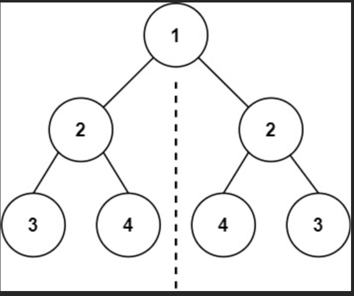
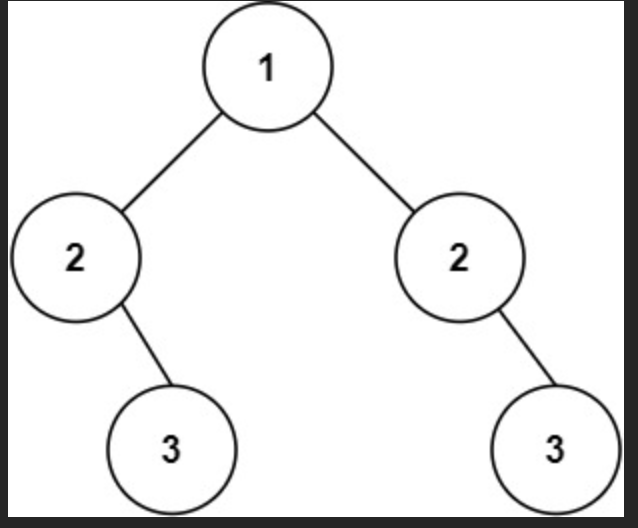

# 94.二叉树的中序遍历
https://leetcode.cn/problems/binary-tree-inorder-traversal/description/?envType=study-plan-v2&envId=top-100-liked
给定一个二叉树的根节点 root ，返回 它的 中序 遍历 。

提示：

树中节点数目在范围 [0, 100] 内
-100 <= Node.val <= 100


进阶: 递归算法很简单，你可以通过迭代算法完成吗？

***

1. 递归

中序遍历就是先左->当前->右

```java
import java.util.ArrayList;
import java.util.List;

public class TreeNode {
    int val;
    TreeNode left;
    TreeNode right;

    TreeNode() {
    }

    TreeNode(int val) {
        this.val = val;
    }

    TreeNode(int val, TreeNode left, TreeNode right) {
        this.val = val;
        this.left = left;
        this.right = right;
    }
}

class Solution {
    private List<Integer> TreeNodeList = new ArrayList<>();

    public List<Integer> inorderTraversal(TreeNode root) {
        return inorderHelper(root);
    }

    private List<Integer> inorderHelper(TreeNode root) {
        if (root == null){
            return TreeNodeList;
        }
        inorderHelper(root.left);
        TreeNodeList.add(root.val);
        inorderHelper(root.right);
        return TreeNodeList;
    }
}
```
时空复杂度都是O(n)

2. 迭代

递归隐式维护了一个栈，迭代就要显式维护一个栈

依次向左遍历，并把元素依次入栈，直到左孩子为空，开始依次出栈，直到栈空；

之后出栈一个，这个即为要处理的当前元素，把它加入结果后再开始对右子树准备处理右子树

```java
import java.util.ArrayDeque;
import java.util.ArrayList;
import java.util.Deque;
import java.util.List;

public class TreeNode {
    int val;
    TreeNode left;
    TreeNode right;

    TreeNode() {
    }

    TreeNode(int val) {
        this.val = val;
    }

    TreeNode(int val, TreeNode left, TreeNode right) {
        this.val = val;
        this.left = left;
        this.right = right;
    }
}

class Solution {

    public List<Integer> inorderTraversal(TreeNode root) {
        List<Integer> result = new ArrayList<>();
        Deque<TreeNode> stack = new ArrayDeque<>();
        TreeNode cur = root;
        while (cur != null || !stack.isEmpty()) {
            while (cur != null) {
                stack.push(cur);
                cur = cur.left;
            }
            cur = stack.pop();//pop是出栈
            result.add(cur.val);
            cur = cur.right;
        }
        return result;
    }
}
```
时空依然都是O(n)

3. Morris 中序遍历

考虑使用二叉树本身的结构来替代栈，从而降低空间复杂度

上面的空间复杂度的核心是，当我们遍历完左侧，需要用栈（或者调用栈）来记录我们要回到哪个节点

可以考虑使用前驱节点来替代（中序遍历当前节点的上一个，也就是左子树的最右侧节点），让它指向当前节点即可

```java
import java.util.ArrayList;
import java.util.List;

/**
 * Definition for a binary tree node.
 * public class TreeNode {
 *     int val;
 *     TreeNode left;
 *     TreeNode right;
 *     TreeNode() {}
 *     TreeNode(int val) { this.val = val; }
 *     TreeNode(int val, TreeNode left, TreeNode right) {
 *         this.val = val;
 *         this.left = left;
 *         this.right = right;
 *     }
 * }
 */

public class TreeNode {
    int val;
    TreeNode left;
    TreeNode right;

    TreeNode() {
    }

    TreeNode(int val) {
        this.val = val;
    }

    TreeNode(int val, TreeNode left, TreeNode right) {
        this.val = val;
        this.left = left;
        this.right = right;
    }
}

class Solution {
    public List<Integer> inorderTraversal(TreeNode root) {
        List<Integer> result = new ArrayList<>();
        while (root != null){
            if (root.left != null){
                TreeNode predecessor = root.left;
                while (predecessor.right != null && predecessor.right != root){
                    predecessor = predecessor.right;
                }
                if (predecessor.right == null){
                    predecessor.right = root;
                    root = root.left;
                }else {//左树已经访问完了
                    predecessor.right = null;
                    result.add(root.val);
                    root = root.right;
                }
            }else {
                result.add(root.val);
                root = root.right;
            }
        }
        return result;
    }
}
```
把这个再看看吧

# 104. 二叉树的最大深度
https://leetcode.cn/problems/maximum-depth-of-binary-tree/description/?envType=study-plan-v2&envId=top-100-liked
给定一个二叉树 root ，返回其最大深度。

二叉树的 最大深度 是指从根节点到最远叶子节点的最长路径上的节点数。


示例 1：

输入：root = [3,9,20,null,null,15,7]
输出：3
示例 2：

输入：root = [1,null,2]
输出：2


提示：

树中节点的数量在 [0, 104] 区间内。
-100 <= Node.val <= 100

***

深度优先搜索。简单的想法就是深度优先，同时记录长度，每次遍历到叶节点更新一次长度。

一般的深度优先采取的是递归，很难记录到达叶节点的位置。

1. 深度优先搜索

如果使用递归深度优先，考虑分解。

最高高度 = max(左子树高度，右子树高度) + 1。

基本情况就是root == null返回0

时间复杂度：平均的话是T(n) = 2T((n-1)/2) + O(1) 。本地O（1），子问题n^(log2_2) 就是n，因此最终时间复杂度O(n)。也可以直接整体分析，每次对每个节点的调用本地操作都是O(1),但是要对每个节点调用一次。

空间复杂度：调用栈最多调用二叉树高度，最差是O(n)
```java
/**
 * Definition for a binary tree node.
 * public class TreeNode {
 *     int val;
 *     TreeNode left;
 *     TreeNode right;
 *     TreeNode() {}
 *     TreeNode(int val) { this.val = val; }
 *     TreeNode(int val, TreeNode left, TreeNode right) {
 *         this.val = val;
 *         this.left = left;
 *         this.right = right;
 *     }
 * }
 */
 public class TreeNode {
     int val;
     TreeNode left;
     TreeNode right;
     TreeNode() {}
     TreeNode(int val) { this.val = val; }
     TreeNode(int val, TreeNode left, TreeNode right) {
         this.val = val;
         this.left = left;
         this.right = right;
     }
 }

class Solution {
    public int maxDepth(TreeNode root) {
        return maxDepthHelp(root);
    }
    private int maxDepthHelp(TreeNode root){
        if (root == null){
            return 0;
        }
        return Math.max(maxDepthHelp(root.left),maxDepthHelp(root.right)) + 1;
    }
}
```
2. 广度优先

```java
List<Integer> levelOrder(TreeNode root) {
    //初始化一个队列,作为遍历过程中的临时储存。
    Queue<TreeNode> queue = new LinkedList<>();
    queue.add(root);
    //初始化一个列表储存结果
    List<Integer> result = new ArrayList<>();
    while (!queue.isEmpty())
    {
        TreeNode node = queue.poll();//出队
        result.add(node.val);
        if(node.left != null){
            queue.offer(node.left);
        }
        if(node.right != null)
        {
            queue.offer(node.right);
        }
    }
    return result;
}

```
也可以采用广度优先,上面是标准的广度优先遍历

广度优先搜索要先进先出，采用queue。每搜索一层，高度+1.关键在于怎么判断搜索完了一层。

可以在每次循环的开始，先获取当前queue中的元素个数，这个实际上就是本层的个数。然后采用for循环，直接把这层的元素全部出队并把对应的子节点放入，同时depth++即可。

```java
 import java.util.LinkedList;
import java.util.Queue;

public class TreeNode {
    int val;
    TreeNode left;
    TreeNode right;

    TreeNode() {
    }

    TreeNode(int val) {
        this.val = val;
    }

    TreeNode(int val, TreeNode left, TreeNode right) {
        this.val = val;
        this.left = left;
        this.right = right;
    }
}

class Solution {
    public int maxDepth(TreeNode root) {
        if (root == null){
            return 0;
        }
        Queue<TreeNode> queue = new LinkedList<>();//双向链表的队列实现
        int depth = 0;
        queue.add(root);
        while (!queue.isEmpty()){
            int thisLevelSize = queue.size();
            for (int i = 0; i < thisLevelSize; i++) {
                TreeNode node = queue.poll();
                if (node.left != null){
                    queue.add(node.left);
                }
                if (node.right != null){
                    queue.add(node.right);
                }
            }
            depth++;
        }
        return depth;
    }
}

```
时空都是O(n)

注意：

| 操作 | `LinkedList` (双向链表) | `ArrayDeque` (循环数组) | 解释 |
| :--- | :--- | :--- | :--- |
| **入队 (add/offer)** | **O(1)** | **Amortized O(1)** | `LinkedList` 只是在尾部添加一个新节点并更新指针。`ArrayDeque` 在数组尾部添加元素，绝大多数情况是 O(1)，但如果数组满了，需要进行一次 O(n) 的扩容和复制操作。不过，由于扩容不是每次都发生，所以平摊下来（Amortized）的时间复杂度是 O(1)。 |
| **出队 (poll/remove)** | **O(1)** | **O(1)** | `LinkedList` 只是移除头节点并更新指针。`ArrayDeque` 只是移动头指针的索引，并不会移动数组中的其他元素，所以也是 O(1)。 |
| **内存使用** | **更高** | **更低** | 这是 `ArrayDeque` 的巨大优势。`LinkedList` 的每个元素都需要一个额外的 `Node` 对象来包装，这个对象本身以及它内部的 `prev` 和 `next` 引用都会占用额外的内存。而 `ArrayDeque` 直接将对象存储在数组中，内存开销小得多。 |
| **CPU 缓存友好度** | **差** | **好** | 这是另一个关键性能优势。`ArrayDeque` 的元素在内存中是连续存储的，这使得 CPU 在访问一个元素后，可以很高效地预加载它旁边的元素到高速缓存（Cache）中，这被称为“缓存局部性”（Cache Locality）。而 `LinkedList` 的节点在内存中是分散的，访问下一个节点可能会导致“缓存未命中”（Cache Miss），需要从主内存中重新加载，速度慢得多。 |

实际上这里最好用ArrayDeque来作为实现更好。

# 226. 翻转二叉树
https://leetcode.cn/problems/invert-binary-tree/description/?envType=study-plan-v2&envId=top-100-liked

给你一棵二叉树的根节点 root ，翻转这棵二叉树，并返回其根节点。
示例 1：
输入：root = [4,2,7,1,3,6,9]
输出：[4,7,2,9,6,3,1]
示例 2：
输入：root = [2,1,3]
输出：[2,3,1]
示例 3：

输入：root = []
输出：[]


提示：

树中节点数目范围在 [0, 100] 内
-100 <= Node.val <= 100

***
简单的想法就是分治递归：

翻转左子树，翻转右子树，再把左右子树调换（翻转本层）。

基本情况：如果是null，直接返回

时间复杂度：每个节点要调用一次，每次本地操作成本是O(1),因此总体是O(n)

空间复杂度：调用高度次，因此O(h),最差就是O(n)

```java

/**
 * Definition for a binary tree node.
 * public class TreeNode {
 *     int val;
 *     TreeNode left;
 *     TreeNode right;
 *     TreeNode() {}
 *     TreeNode(int val) { this.val = val; }
 *     TreeNode(int val, TreeNode left, TreeNode right) {
 *         this.val = val;
 *         this.left = left;
 *         this.right = right;
 *     }
 * }
 */
class Solution {
    public TreeNode invertTree(TreeNode root) {
        if (root == null) {
            return root;
        }
        TreeNode leftOld = invertTree(root.left);
        TreeNode rightOld = invertTree(root.right);
        root.left = rightOld;
        root.right = leftOld;
        return root;
    }
}
```
2. 使用栈来代替函数调用栈

上面实际上是深度优先搜索。可以使用一个栈来代替函数调用栈，把迭代转换成递归

具体来说，使用循环，每次只要栈不为空，就把节点出栈，把它的左右子节点交换，之后再把子节点入栈。

```java
import java.util.ArrayDeque;
import java.util.Deque;
import java.util.Stack;

/**
 * Definition for a binary tree node.
 * public class TreeNode {
 *     int val;
 *     TreeNode left;
 *     TreeNode right;
 *     TreeNode() {}
 *     TreeNode(int val) { this.val = val; }
 *     TreeNode(int val, TreeNode left, TreeNode right) {
 *         this.val = val;
 *         this.left = left;
 *         this.right = right;
 *     }
 * }
 */

public class TreeNode {
    int val;
    TreeNode left;
    TreeNode right;

    TreeNode() {
    }

    TreeNode(int val) {
        this.val = val;
    }

    TreeNode(int val, TreeNode left, TreeNode right) {
        this.val = val;
        this.left = left;
        this.right = right;
    }
}

class Solution {
    public TreeNode invertTree(TreeNode root) {
        if (root == null) {
            return root;
        }
        Deque<TreeNode> stack = new ArrayDeque<>();
        stack.push(root);
        while (!stack.isEmpty()) {
            TreeNode cur = stack.pop();

            TreeNode temp = cur.left;
            cur.left = cur.right;
            cur.right = temp;

            if (cur.left != null) {
                stack.push(cur.left);
            }
            if (cur.right != null) {
                stack.push(cur.right);
            }
        }
        return root;
    }
}

```
注意： Java中使用ArrayDeque来实现栈最好，但是ArrayDeque没有实现接口stack，一般使用deque作为栈即可，不适用stack接口。

上面使用栈的解法相当于是前序遍历。

3. 广度优先搜索

也可以使用广度优先

创建一个队列

把root放入

队列中取出一个节点，cur非null则交换子节点

之后把cur子节点入队

```java
import java.util.ArrayDeque;
import java.util.Queue;

public class TreeNode {
    int val;
    TreeNode left;
    TreeNode right;

    TreeNode() {
    }

    TreeNode(int val) {
        this.val = val;
    }

    TreeNode(int val, TreeNode left, TreeNode right) {
        this.val = val;
        this.left = left;
        this.right = right;
    }
}

class Solution {
    public TreeNode invertTree(TreeNode root) {
        if (root == null) {
            return root;
        }
        Queue<TreeNode> queue = new ArrayDeque<>();
        queue.add(root);
        while (!queue.isEmpty()){
            TreeNode cur = queue.poll();
            if (cur != null){
                TreeNode temp = cur.left;
                cur.left = cur.right;
                cur.right = temp;
            }
            if (cur.left!=null){
                queue.add(cur.left);
            }
            if (cur.right != null){
                queue.add(cur.right);
            }
        }
        return root;
    }
}
```

# 101. 对称二叉树
https://leetcode.cn/problems/symmetric-tree/description/?envType=study-plan-v2&envId=top-100-liked

给你一个二叉树的根节点 root ， 检查它是否轴对称。


示例 1：


输入：root = [1,2,2,3,4,4,3]
输出：true
示例 2：


输入：root = [1,2,2,null,3,null,3]
输出：false


提示：

树中节点数目在范围 [1, 1000] 内
-100 <= Node.val <= 100


进阶：你可以运用递归和迭代两种方法解决这个问题吗？

****

分治递归：

基本情况：为空或者只有一个节点天然对称

左右子树关于对称轴对称。

也就是要满足，

1. 根节点必须相等
2. left_tree的左子树要和right_tree的右子树对称
3. left_tree的右子树要和right_tree的左子树对称

```java
/**
 * Definition for a binary tree node.
 * public class TreeNode {
 *     int val;
 *     TreeNode left;
 *     TreeNode right;
 *     TreeNode() {}
 *     TreeNode(int val) { this.val = val; }
 *     TreeNode(int val, TreeNode left, TreeNode right) {
 *         this.val = val;
 *         this.left = left;
 *         this.right = right;
 *     }
 * }
 */

 public class TreeNode {
     int val;
     TreeNode left;
     TreeNode right;
     TreeNode() {}
     TreeNode(int val) { this.val = val; }
     TreeNode(int val, TreeNode left, TreeNode right) {
         this.val = val;
         this.left = left;
         this.right = right;
     }
 }

class Solution {
    public boolean isSymmetric(TreeNode root) {
        if (root == null){
            return true;
        }
        return help(root.left,root.right);
    }
    private boolean help(TreeNode node1,TreeNode node2){
        if ((node1 == null && node2!=null) ||(node1 != null && node2 == null)){
            return false;
        }
        if (node1 == null && node2 == null){
            return true;
        }
        if (node1.val == node2.val){
            return help(node1.left,node2.right) && help(node1.right,node2.left);
        }else {
            return false;
        }
    }
}
```

时间复杂度：O(n).递归树中最坏每个节点要调用一次，每个节点的本地调用都是O(1)

空间：O(n),递归到叶节点返回。最差情况退化成两个链表，深度O(n/2)

如下

```
      1
     / \
    2   2
   /     \
  3       3
 /         \
4           4
```

实际上上面的方法算是一种深度优先。先深入两条路径直到叶节点比较是否对称

2. 迭代，BFS

使用一个队列，一次镜像入队，比较节点值是否相同

```java
 import java.util.LinkedList;
import java.util.Queue;

public class TreeNode {
    int val;
    TreeNode left;
    TreeNode right;

    TreeNode() {
    }

    TreeNode(int val) {
        this.val = val;
    }

    TreeNode(int val, TreeNode left, TreeNode right) {
        this.val = val;
        this.left = left;
        this.right = right;
    }
}

class Solution {
    public boolean isSymmetric(TreeNode root) {
        if (root == null) {
            return true;
        }
        Queue<TreeNode> queue = new LinkedList<>();
        queue.offer(root.left);
        queue.offer(root.right);
        while (!queue.isEmpty()){
            TreeNode left = queue.poll();
            TreeNode right = queue.poll();
            if (left == null && right == null){
                continue;
            }
            if (left == null || right == null){
                return false;
            }
            if (left.val != right.val){
                return false;
            }
            queue.offer(left.left);
            queue.offer(right.right);
            queue.offer(left.right);
            queue.offer(right.left);
        }
        return true;
    }
    
}

```
时间复杂度: O(n)。每个节点都要出队入队比较一次，非叶节点还要访问子节点，都是常数操作

空间复杂度：O(n).队列最大是叶节点，O(2^(logn)) = O(n)

# 543. 二叉树的直径
https://leetcode.cn/problems/diameter-of-binary-tree/description/?envType=study-plan-v2&envId=top-100-liked

给你一棵二叉树的根节点，返回该树的 直径 。

二叉树的 直径 是指树中任意两个节点之间最长路径的 长度 。这条路径可能经过也可能不经过根节点 root 。

两节点之间路径的 长度 由它们之间边数表示。


示例 1：


输入：root = [1,2,3,4,5]
输出：3
解释：3 ，取路径 [4,2,1,3] 或 [5,2,1,3] 的长度。
示例 2：

输入：root = [1,2]
输出：1


提示：

树中节点数目在范围 [1, 104] 内
-100 <= Node.val <= 100

***

对于每个节点，经过这个节点的最大路径都是他的左子树最大深度和右子树最大深度之和。

但是记得实现的时候要保存左右子树的深度以便让父节点使用避免重复计算，记忆化搜索。可以直接返回调用节点的深度即可，方便父节点直接算出对应子树深度

维护一个最大变量

```java
/**
 * Definition for a binary tree node.
 * public class TreeNode {
 *     int val;
 *     TreeNode left;
 *     TreeNode right;
 *     TreeNode() {}
 *     TreeNode(int val) { this.val = val; }
 *     TreeNode(int val, TreeNode left, TreeNode right) {
 *         this.val = val;
 *         this.left = left;
 *         this.right = right;
 *     }
 * }
 */
 public class TreeNode {
     int val;
     TreeNode left;
     TreeNode right;
     TreeNode() {}
     TreeNode(int val) { this.val = val; }
     TreeNode(int val, TreeNode left, TreeNode right) {
         this.val = val;
         this.left = left;
         this.right = right;
     }
 }

class Solution {
    int maxLength = 0;
    public int diameterOfBinaryTree(TreeNode root) {
        maxDepth(root);
        return maxLength;
    }
    private int maxDepth(TreeNode node){
        if (node == null){
            return 0;
        }
        int max_left = maxDepth(node.left);
        int max_right = maxDepth(node.right);
        //算出左右子树的高度，并且期间把maxLength更新为左右子树的最大直径的最大值。
        //事实上，这实际上也是个后续遍历
        maxLength = Math.max(maxLength,max_left + max_right);
        //把本树的最大直径更新
        int depth = Math.max(max_left,max_right) + 1;
        return depth;
    }
}
```
时间复杂度：O(n).要访问每个节点，每个节点的本地操作都是更新maxLength，算出depth并且返回，都是O(1),

空间复杂度:O(n).最差成为链表O(n)

# 102. 二叉树的层序遍历
https://leetcode.cn/problems/binary-tree-level-order-traversal/description/?envType=study-plan-v2&envId=top-100-liked

给你二叉树的根节点 root ，返回其节点值的 层序遍历 。 （即逐层地，从左到右访问所有节点）。


示例 1：


输入：root = [3,9,20,null,null,15,7]
输出：[[3],[9,20],[15,7]]
示例 2：

输入：root = [1]
输出：[[1]]
示例 3：

输入：root = []
输出：[]


提示：

树中节点数目在范围 [0, 2000] 内
-1000 <= Node.val <= 1000

```java
import java.util.*;

/**
 * Definition for a binary tree node.
 * public class TreeNode {
 *     int val;
 *     TreeNode left;
 *     TreeNode right;
 *     TreeNode() {}
 *     TreeNode(int val) { this.val = val; }
 *     TreeNode(int val, TreeNode left, TreeNode right) {
 *         this.val = val;
 *         this.left = left;
 *         this.right = right;
 *     }
 * }
 */

public class TreeNode {
    int val;
    TreeNode left;
    TreeNode right;

    TreeNode() {
    }

    TreeNode(int val) {
        this.val = val;
    }

    TreeNode(int val, TreeNode left, TreeNode right) {
        this.val = val;
        this.left = left;
        this.right = right;
    }
}

class Solution {
    public List<List<Integer>> levelOrder(TreeNode root) {
        if (root == null) {
            return new ArrayList<>();
        }
        List<List<Integer>> result = new ArrayList<>();
        Queue<TreeNode> queue = new ArrayDeque<>();
        queue.offer(root);
        while (!queue.isEmpty()) {
            int size = queue.size();
            List<Integer> temp = new ArrayList<>();
            for (int i = 0; i < size; i++) {
                TreeNode cur = queue.poll();
                temp.add(cur.val);
                if (cur.left != null) {
                    queue.offer(cur.left);
                }
                if (cur.right != null){
                    queue.offer(cur.right);
                }
            }
            result.add(temp);
        }
        return result;
    }
}
```
时间复杂度：O(n)。遍历所有节点，每个节点都执行入队出队判空添加获取队列大小等常数操作，最终就是O(n)

空间复杂度：O(n).队列储存最大的一层，最差很平衡的情况，是n/2

# 108. 将有序数组转换为二叉搜索树
https://leetcode.cn/problems/convert-sorted-array-to-binary-search-tree/description/?envType=study-plan-v2&envId=top-100-liked

给你一个整数数组 nums ，其中元素已经按 升序 排列，请你将其转换为一棵 平衡 二叉搜索树。（平衡二叉树 是指该树所有节点的左右子树的高度相差不超过 1。）


示例 1：


输入：nums = [-10,-3,0,5,9]
输出：[0,-3,9,-10,null,5]
解释：[0,-10,5,null,-3,null,9] 也将被视为正确答案：

示例 2：


输入：nums = [1,3]
输出：[3,1]
解释：[1,null,3] 和 [3,1] 都是高度平衡二叉搜索树。


提示：

1 <= nums.length <= 104
-104 <= nums[i] <= 104
nums 按 严格递增 顺序排列

***

相当于已经给出了中序遍历的结果

根据这个中序遍历结果来构建平衡二叉树

感觉天然是递归的问题

先找到中间的一个数作为根节点，之后以它为界限划分成两个数组构建两个左右子树即可。

基本情况就是数组长度为0.

返回值返回头节点。
```java
/**
 * Definition for a binary tree node.
 * public class TreeNode {
 *     int val;
 *     TreeNode left;
 *     TreeNode right;
 *     TreeNode() {}
 *     TreeNode(int val) { this.val = val; }
 *     TreeNode(int val, TreeNode left, TreeNode right) {
 *         this.val = val;
 *         this.left = left;
 *         this.right = right;
 *     }
 * }
 */

 public class TreeNode {
     int val;
     TreeNode left;
     TreeNode right;
     TreeNode() {}
     TreeNode(int val) { this.val = val; }
     TreeNode(int val, TreeNode left, TreeNode right) {
         this.val = val;
         this.left = left;
         this.right = right;
     }
}

class Solution {
    public TreeNode sortedArrayToBST(int[] nums) {
        return sortedHelper(nums,0,nums.length - 1);
    }
    private TreeNode sortedHelper(int[] nums,int left,int right){
        if (left > right){
            return null;
        }
        int mid = left + (right - left) / 2;
        TreeNode root = new TreeNode(nums[mid]);
        TreeNode leftChild = sortedHelper(nums,left,mid - 1);
        TreeNode rightChild = sortedHelper(nums,mid + 1,right);
        root.left = leftChild;
        root.right = rightChild;
        return root;
    }
}
```
时间复杂度：O(n).要访问所有的数字，对于每个数字，要创建新节点，计算mid，给节点左右指针赋值，都是O(1),最终是O(n)

空间：O(logn).不计算储存空间的话，函数调用栈需要调用到函数最大深度，平衡树深度近似认为logn

# 98. 验证二叉搜索树

https://leetcode.cn/problems/validate-binary-search-tree/description/?envType=study-plan-v2&envId=top-100-liked

给你一个二叉树的根节点 root ，判断其是否是一个有效的二叉搜索树。

有效 二叉搜索树定义如下：

节点的左子树只包含 严格小于 当前节点的数。
节点的右子树只包含 严格大于 当前节点的数。
所有左子树和右子树自身必须也是二叉搜索树。


示例 1：


输入：root = [2,1,3]
输出：true
示例 2：


输入：root = [5,1,4,null,null,3,6]
输出：false
解释：根节点的值是 5 ，但是右子节点的值是 4 。


提示：

树中节点数目范围在[1, 104] 内
-231 <= Node.val <= 231 - 1

***

二叉树本身就是递归的，还是先考虑递归

基本情况就是头节点左右孩子均为null就认为是true

只有一个孩子的话也单独列出来作为基本情况，因为此时不对称不是递归的了

先判断是否满足左孩子<根节点<右孩子

之后要找到左子树最右边的数，它要小于根节点；以及右子树最左边的数，他要大于根节点，否则返回false


之后判断左子树，右子树是否是搜索树，有一个不是直接返回false

都满足返回true


这个方法可以，但是效率很低。如果是个退化成接近链表的，对于每个节点都要遍历其左子树或者右子树到头，总体来说复杂度O(n^2)

1. 递归时限定范围

根节点传入负无穷到正无穷范围（头节点可以随便取）

左子树范围要求必须是原本下限到根节点（双开区间）；

右子树必须是根节点到原本上限；

具体步骤

null直接返回true

检查当前node.val是否在min_val,max_val

检查左子树，确保左子树范围都在min_val和node.val

检查右子树

都为真返回true
```java
/**
 * Definition for a binary tree node.
 * public class TreeNode {
 *     int val;
 *     TreeNode left;
 *     TreeNode right;
 *     TreeNode() {}
 *     TreeNode(int val) { this.val = val; }
 *     TreeNode(int val, TreeNode left, TreeNode right) {
 *         this.val = val;
 *         this.left = left;
 *         this.right = right;
 *     }
 * }
 */
 public class TreeNode {
     int val;
     TreeNode left;
     TreeNode right;
     TreeNode() {}
     TreeNode(int val) { this.val = val; }
     TreeNode(int val, TreeNode left, TreeNode right) {
         this.val = val;
         this.left = left;
         this.right = right;
     }
 }

class Solution {
    public boolean isValidBST(TreeNode root) {
        return isValid(root,Long.MIN_VALUE,Long.MAX_VALUE);
    }
    private boolean isValid(TreeNode node,long min_val,long max_val){
        if (node == null){
            return true;
        }
        if (node.val <= min_val || node.val >= max_val){
            return false;
        }
        //相信isValid能够检查出来左子树和右子树本身是否是合法的搜索树并且所有节点的值范围都在给定的范围内
        return isValid(node.left, min_val, node.val) && isValid(node.right, node.val, max_val);
    }
}
```
时间复杂度：O(n).每个节点都要调用一次，每个节点的调用都是判空、判断范围、获取值和左右指针都是O(1).

空间:最深O(H)，H最差是n

2. 直接中序遍历。搜索树的中序遍历必然是个升序的，只要遍历过程中发现矛盾即可返回false

一般来说，对于需要借助递归的遍历，如果需要一边递归一边处理其他操作，通常我们会选择维护一个额外的成员变量或者给函数添加额外的参数。

| 特性        | 模式一：通过参数传递              | 模式二：通过成员变量维护                               |
|:----------|:------------------------|:-------------------------------------------|
| **信息流**   | **自上而下 (Top-Down)**     | **顺序/全局 (Sequential/Global)**              |
| **状态作用域** | 局部于当前递归路径               | 全局共享                                       |
| **函数纯度**  | 高（无副作用）                 | 低（有副作用）                                    |
| **线程安全**  | 相对安全                    | 不安全                                        |
| **适用问题**  | 依赖 **路径信息** 或 **父节点约束** | 依赖 **遍历顺序** 或 **全局聚合结果** （比如需要上一个遍历的节点的信息） |
| **我们的例子** | 验证BST (限定范围法)           | 验证BST (中序遍历法)                              |


这个题计算维护一个成员变量prev表示上一个节点，只有当前节点比上一个节点大才

```java
public class TreeNode {
    int val;
    TreeNode left;
    TreeNode right;

    TreeNode() {
    }

    TreeNode(int val) {
        this.val = val;
    }

    TreeNode(int val, TreeNode left, TreeNode right) {
        this.val = val;
        this.left = left;
        this.right = right;
    }
}

class Solution {
    long prev ;//认为最初遍历前的上一个元素是无穷小,使用Long的最小值，确保比任何int都小
    public boolean isValidBST(TreeNode root) {
        prev = Long.MIN_VALUE;
        return inOrderDFS(root);
    }
    
    private boolean inOrderDFS(TreeNode node){
        if (node == null){
            return true;
        }
        //先检查左子树是否是中序遍历升序
        if(!inOrderDFS(node.left)){
            return false;
        }
        //检查中序遍历的上一个值和node.val是否满足升序
        if (node.val <= prev){
            return false;
        }
        //更新prev为当前节点
        prev = node.val;
        //比较右子树是否中序遍历升序
        return inOrderDFS(node.right);
    }
}

```
时间复杂度:O(n),遍历所有节点，每个节点都要判空，比较和prev，更新prev都是O(1)操作

空间：O(h),最差退化到O(n)

也可以使用迭代的中序遍历：

迭代的中序遍历：

poll,remove出队

pop出栈

1. 手动创建一个栈stack，cur初始化为root
2. 进行循环，条件是cur不为null或者stack非空
3. 循环内，首先第一步，只要cur不为空，就把cur入栈，之后就把cur更新为cur.left
4. cur为空则开始将cur指向stack.pop()，并把cur加入结果，之后cur更新为cur.right

实际上，压栈就是代表要去先访问左子树，出栈表示左子树已经遍历完了，现在访问cur，每个节点都是实际上在此刻被访问的，下一个更新为右孩子表示处理右子树去


具体到这个题，不必使用结果列表记录，维护一个prev，在第四步出栈的时候，和prev比较即可。
```java
import java.util.ArrayDeque;
import java.util.Deque;

/**
 * Definition for a binary tree node.
 * public class TreeNode {
 *     int val;
 *     TreeNode left;
 *     TreeNode right;
 *     TreeNode() {}
 *     TreeNode(int val) { this.val = val; }
 *     TreeNode(int val, TreeNode left, TreeNode right) {
 *         this.val = val;
 *         this.left = left;
 *         this.right = right;
 *     }
 * }
 */
public class TreeNode {
    int val;
    TreeNode left;
    TreeNode right;

    TreeNode() {
    }

    TreeNode(int val) {
        this.val = val;
    }

    TreeNode(int val, TreeNode left, TreeNode right) {
        this.val = val;
        this.left = left;
        this.right = right;
    }
}

class Solution {
    public boolean isValidBST(TreeNode root) {
        if (root == null) {
            return true;
        }
        long prev = Long.MIN_VALUE;
        Deque<TreeNode> stack = new ArrayDeque<>();
        TreeNode cur = root;
        while (cur != null || !stack.isEmpty()){
            while (cur != null){
                stack.push(cur);
                cur = cur.left;
            }
            cur = stack.pop();
            if (cur.val <= prev){
                return false;
            }
            prev =(long)cur.val;
            cur = cur.right;
        }
        return true;
    }
}
```
时间复杂度：O(n),要遍历整个节点，每个节点操作出栈出栈，比较更新prev都是O(1)

空间:O(H)，栈最差要储存高度个节点，因此最差是H=n,O(n)


# 230. 二叉搜索树中第 K 小的元素

https://leetcode.cn/problems/kth-smallest-element-in-a-bst/description/?envType=study-plan-v2&envId=top-100-liked

给定一个二叉搜索树的根节点 root ，和一个整数 k ，请你设计一个算法查找其中第 k 小的元素（从 1 开始计数）。


示例 1：


输入：root = [3,1,4,null,2], k = 1
输出：1
示例 2：


输入：root = [5,3,6,2,4,null,null,1], k = 3
输出：3


提示：

树中的节点数为 n 。
1 <= k <= n <= 104
0 <= Node.val <= 104


进阶：如果二叉搜索树经常被修改（插入/删除操作）并且你需要频繁地查找第 k 小的值，你将如何优化算法？

***

最最简单的想法就是中序遍历的第k个元素

时间复杂度O(k)?找到第k个直接返回就行，最差O(n);

空间递归实现的话O(k)，最差O(n)

```java
/**
 * Definition for a binary tree node.
 * public class TreeNode {
 *     int val;
 *     TreeNode left;
 *     TreeNode right;
 *     TreeNode() {}
 *     TreeNode(int val) { this.val = val; }
 *     TreeNode(int val, TreeNode left, TreeNode right) {
 *         this.val = val;
 *         this.left = left;
 *         this.right = right;
 *     }
 * }
 */

 public class TreeNode {
     int val;
     TreeNode left;
     TreeNode right;
     TreeNode() {}
     TreeNode(int val) { this.val = val; }
     TreeNode(int val, TreeNode left, TreeNode right) {
         this.val = val;
         this.left = left;
         this.right = right;
     }
 }

class Solution {
     int count = 0;
     int result;
    public int kthSmallest(TreeNode root, int k) {
        inOrderSearchK(root,k);
        return result;
    }
    private void inOrderSearchK(TreeNode node,int k){
        if (node == null){
            return ;
        }
        if (count >= k){
            return;//剪枝：如果初始时count就相等或者更大了，说明之前已经找到了结果直接返回
        }
        inOrderSearchK(node.left,k);//相信函数可以找到左子树第k个数字（如果第k个数存在在左子树里面的话），并且更新count
        if (count >= k){
            return;//剪枝：如果左子树已经找到了，直接返回即可
        }
        count++;//访问了本节点，count需要加一
        if (count == k){
            result = node.val;
            return;
        }
        inOrderSearchK(node.right,k);
    }
}
```

迭代实现,占位
```java

```