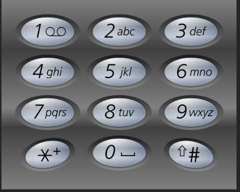

[回溯.md](../%E5%9F%BA%E6%9C%AC%E7%AE%97%E6%B3%95/%E5%9B%9E%E6%BA%AF.md)
# 46. 全排列
给定一个不含重复数字的数组 nums ，返回其 所有可能的全排列 。你可以 按任意顺序 返回答案。


示例 1：

输入：nums = [1,2,3]
输出：[[1,2,3],[1,3,2],[2,1,3],[2,3,1],[3,1,2],[3,2,1]]
示例 2：

输入：nums = [0,1]
输出：[[0,1],[1,0]]
示例 3：

输入：nums = [1]
输出：[[1]]


提示：

1 <= nums.length <= 6
-10 <= nums[i] <= 10
nums 中的所有整数 互不相同

***
经典回溯，

套用框架代码

```java
import java.util.ArrayList;
import java.util.List;

class Solution {
    public List<List<Integer>> permute(int[] nums) {
        permuteHelper(nums);
        return result;
    }

    List<List<Integer>> result = new ArrayList<>();
    List<Integer> path = new ArrayList<>();

    private void permuteHelper(int[] nums) {
        if (path.size() == nums.length) {
            result.add(new ArrayList<>(path));
            return;//直接返回即可，因为我们已经到了路径最末端
        }
        for (int choice : nums) {
            if (path.contains(choice)) {///剪枝
                continue;
            }
            path.add(choice);//做出选择
            permuteHelper(nums); //继续选择
            path.remove(path.size() - 1);//回退
        }
    }
}
```
注意：
1. 列表添加东西，除了基本数据类型比如int等，加入的都是引用（就是指针）,因此添加要创建新的对象
2. 时间复杂度O(n^2 * n!),空间复杂度O(n)。不对吧，节点数应该是O(n + n(n-1) + n(n-2) + ……+n!)等于O(n!)，每个节点的需要O(1+2+3+……n)=O(n^2)，因此最终是O(n^2*n!)
3. 实际上可以优化。因为path.contains(choice)有一个O(n)的复杂度，使用一个布尔数组代表是否使用更好

```java
class Solution {
    List<List<Integer>> result = new ArrayList<>();
    List<Integer> path = new ArrayList<>();
    boolean[] used ;

    public List<List<Integer>> permute(int[] nums) {
        used = new boolean[nums.length];
        permuteHelper(nums);
        return result;
    }


    private void permuteHelper(int[] nums) {
        if (path.size() == nums.length) {
            result.add(new ArrayList<>(path));
            return;//直接返回即可，因为我们已经到了路径最末端
        }
        for (int i = 0;i < nums.length ; i++) {
            int choice = nums[i];
            if (used[i]) {///剪枝
                continue;
            }
            path.add(choice);//做出选择
            used[i] = true;
            permuteHelper(nums); //继续选择
            path.remove(path.size() - 1);//回退
            used[i] = false;
        }
    }
}

```
时间复杂度降到O(n*n!)

其他方法
1. 原地交换法 (Swap-based Backtracking)(掌握)
   1.  定义一个递归函数 `backtrack(index, nums)`，表示对 `nums` 数组从 `index` 位置开始进行全排列。
   2.  **递归终止条件**：当 `index` 等于数组长度时，说明已经生成了一个完整的排列，将其添加到结果列表中。
   3.  **遍历与交换**：在递归函数内部，从 `index` 到数组末尾进行遍历（用 `i` 表示）。将 `index` 位置的元素与 `i` 位置的元素进行交换。
   4.  **递归深入**：交换后，固定住 `index` 位置的元素，对 `index + 1` 之后的部分继续进行全排列，即调用 `backtrack(index + 1, nums)`。
   5.  **回溯**：在递归调用返回后，**必须将之前交换的元素换回来**，以恢复数组状态，确保不影响上一层的循环。这步是回溯的关键。

**实际上就是直接借助原本输入数组来记录使用过的元素**

```java
import java.util.*;

class Solution {
    public List<List<Integer>> permute(int[] nums) {
        List<List<Integer>> result = new ArrayList<>();
        List<Integer> numsList = new ArrayList<>();
        for (int num : nums) {
            numsList.add(num);
        }
        permuteHelper(0, numsList, result);
        return result;
    }


    private void permuteHelper(int index, List<Integer> numsList, List<List<Integer>> result) {
        if (index == numsList.size()) {
            result.add(new ArrayList<>(numsList));
            return;
        }

        //循环来确定把哪个数放在index处
        for (int i = index; i < numsList.size(); i++) {
            Collections.swap(numsList, i, index);//做出选择
            permuteHelper(index + 1, numsList, result);//继续选择
            Collections.swap(numsList, i, index);//回溯选择
        }
    }
}

```
或者直接不用副本更减少空间复杂度

```java
import java.util.Arrays;

class Solution {
    public List<List<Integer>> permute(int[] nums) {
        List<List<Integer>> result = new ArrayList<>();
        permuteHelper(0, nums, result);
        return result;
    }

    private void permuteHelper(int index, int[] nums, List<List<Integer>> result) {
        if (index == nums.length) {
            // 将 int[] 转换为 List<Integer> 并添加到结果中
            List<Integer> permutation = new ArrayList<>();
            for (int num : nums) {
                permutation.add(num);
            }
            result.add(permutation);
            return;
        }

        for (int i = index; i < nums.length; i++) {
            swap(nums, i, index);
            permuteHelper(index + 1, nums, result);
            swap(nums, i, index); // 回溯
        }
    }

    private void swap(int[] nums, int i, int j) {
        int temp = nums[i];
        nums[i] = nums[j];
        nums[j] = temp;
    }
    
}
```
注意：
1. 关于根据数组构造List：
   1. Collection要实现增删查遍历才算集合，因此数组不是集合，不能直接new ArrayList(Object[])，想要创建最好就是遍历。
2. 关于Arrays.asList()
   1. 返回的List固定大小，不支持增删
   2. 返回的List是原数组的一个视图，对List的修改直接会修改原数组
   3. 基本对象数组无法被正确识别：方法签名是public static <T> List<T> asList(T... a)，基本类型数组比如int[] a,int无法被看作一个对象无法当作泛型，因此会把int[]整体当作一个泛型，得到的是一个List<int[]>,如果一定要用直接使用包装类Intenger[] a


# 78.子集
https://leetcode.cn/problems/subsets/?envType=study-plan-v2&envId=top-100-liked
给你一个整数数组 nums ，数组中的元素 互不相同 。返回该数组所有可能的子集（幂集）。

解集 不能 包含重复的子集。你可以按 任意顺序 返回解集。


示例 1：

输入：nums = [1,2,3]
输出：[[],[1],[2],[1,2],[3],[1,3],[2,3],[1,2,3]]
示例 2：

输入：nums = [0]
输出：[[],[0]]


提示：

1 <= nums.length <= 10
-10 <= nums[i] <= 10
nums 中的所有元素 互不相同

***
1. 考虑回溯

```java
import java.util.ArrayList;
import java.util.List;

class Solution {
    List<Integer> path = new ArrayList<>();
    public List<List<Integer>> subsets(int[] nums) {
        List<List<Integer>> result = new ArrayList<>();
        subsetsHelper(nums,0,result,path);
        return result;
    }

    private void subsetsHelper(int[] nums,int start, List<List<Integer>> result,List<Integer> path) {
        result.add(new ArrayList<>(path));//不return，因为可能要继续
        
        for (int i = start; i < nums.length; i++) {
            path.add(nums[i]);
            subsetsHelper(nums, i+1, result,path);//相信sunsetsHelper能够把path已有的作为前缀，从start开始，找出所有可能的组合并放入result，并且最终完成回溯使得path只剩下前缀的状态
            path.remove(path.size() - 1);
        }
    }
}
```
时间复杂度：一共2^n个子集，每个子集都要被复制一次O(l),(kC(n,k),k从0加到n),这个结果就是O(n*2^n。可以分为子集平均长度是n/2,因为每个子集的相对于整个集合的补集也是整个集合的补集，和为n，可以划分成2^n/2个组合，每个组合长度是n，因此总长度n*2^n/2，平均长度n/2

空间复杂度：path O(n),result O(2^n),栈O(n),不算结果最终是O(n)

2. 迭代法


对于一个集合，例如 `S = {1, 2, 3}`，它的所有子集可以被精确地分为两类：
1.  **不包含** 最后一个元素 `3` 的子集。
2.  **包含** 最后一个元素 `3` 的子集。

*   **第一类**：不包含 `3` 的子集，其实就是 `{1, 2}` 的所有子集。
*   **第二类**：包含 `3` 的子集，可以通过获取 `{1, 2}` 的所有子集，然后给每一个子集都添加上元素 `3` 来得到。

所以，如果我们知道了 `P(n-1)`（前 n-1 个元素的所有子集），我们就可以通过以下两步得到 `P(n)`（前 n 个元素的所有子集）：
1.  `P(n)` 包含 `P(n-1)` 的所有内容。
2.  `P(n)` 还包含 `P(n-1)` 中每个子集都加上第 n 个元素后形成的新子集。

步骤

   1.  初始化结果集 `result`，并首先放入一个空集 `[]`。
   2.  遍历 `nums` 数组中的每一个数字 `num`。
   3.  对于 `result` 中已经存在的每一个子集，都创建一个新的子集，将 `num` 添加进去，然后将这个新子集也加入 `result`。
   4.  遍历完所有数字后，`result` 就包含了所有可能的子集。

```java
import java.util.ArrayList;
import java.util.List;

class Solution {
   public List<List<Integer>> subsets(int[] nums) {
      List<List<Integer>> result = new ArrayList<>();
      result.add(new ArrayList<>());
      for (int num : nums) {
          int currentSize = result.size();
         for (int i = 0; i < currentSize; i++) {//这里不能使用for-each循环，因为for—each不允许被迭代对象被修改。
            List<Integer> newSub = new ArrayList<>(result.get(i)); 
            newSub.add(num);
            result.add(newSub);
         }
      }
      return result;
   }

}

```
时间还是O(n*2^n),空间O(n)

# 17.电话号码的字母组合
https://leetcode.cn/problems/letter-combinations-of-a-phone-number/description/?envType=study-plan-v2&envId=top-100-liked
给定一个仅包含数字 2-9 的字符串，返回所有它能表示的字母组合。答案可以按 任意顺序 返回。

给出数字到字母的映射如下（与电话按键相同）。注意 1 不对应任何字母。



示例 1：

输入：digits = "23"
输出：["ad","ae","af","bd","be","bf","cd","ce","cf"]
示例 2：

输入：digits = ""
输出：[]
示例 3：

输入：digits = "2"
输出：["a","b","c"]


提示：

0 <= digits.length <= 4
digits[i] 是范围 ['2', '9'] 的一个数字。

***
思考：

先建立一个列表List<List<Chacacter>>把映射关系存起来。然后分别遍历嵌套循环。

实际上很难嵌套循环，长度是可变的。可以回溯，如果到头了就撤销选择。

映射关系更好的是使用Map<Intenger，String>

空间复杂度是O(n)，时间复杂度O(n*k^n)(k是一个数字对应的字母数)（最差的话就是O(n*4^n)）

```java
import java.util.ArrayList;
import java.util.HashMap;
import java.util.List;
import java.util.Map;

class Solution {

   public List<String> letterCombinations(String digits) {
      Map<Character, String> map = new HashMap<>();
      List<String> result = new ArrayList<>();

      map.put('2', "abc");
      map.put('3', "def");
      map.put('4', "ghi");
      map.put('5', "jkl");
      map.put('6', "mno");
      map.put('7', "pqrs");
      map.put('8', "tuv");
      map.put('9', "wxyz");
      if (digits.isEmpty()){//注意String比较不能用==
          return new ArrayList<>();
      }
      StringBuilder path = new StringBuilder();
      backTrack(map,result,path,digits,0);
      return result;
   }

   private void backTrack(Map<Character,String> map,List<String> result,StringBuilder path,String digits,int start){
       if (path.length() == digits.length()){
           result.add(new String(path));
           return;
       }
      String thisLoopString = map.get(digits.charAt(start));
      for (int j = 0; j < thisLoopString.length(); j++) {
         char c = thisLoopString.charAt(j);
         path.append(c);//做出选择
         backTrack(map,result,path,digits,start+1);//相信backTrack能够把以当前path已经有的为前缀，把从start+1位开始的所有组合得到，并且和前缀结合起来添加到result，并且回溯到只剩下前缀。
         path.deleteCharAt(path.length()-1);//销毁选择
      }
      
   }
}
```
回溯实际上也是深度优先

下面可以用迭代广度优先

2. 迭代

   1.  **初始化**：创建一个队列（`LinkedList` 在 Java 中常被用作队列），并向其中添加一个空字符串 `""`。这个空字符串是所有组合的起点。
   2.  **遍历数字**：遍历输入的数字字符串 `digits` 中的每一个数字。
   3.  **逐层构建**：对于每个数字，遍历当前队列中已有的所有部分组合。
        *   从队列中取出一个部分组合。
        *   获取当前数字对应的所有字母。
        *   将取出的部分组合与每个字母拼接，形成新的、更长的组合。
        *   将这些新组合放入队列的末尾。
   4.  **完成**：当遍历完所有数字后，队列中剩下的就是所有最终的完整组合。

```java
import java.util.ArrayList;
import java.util.LinkedList;
import java.util.Queue;
import java.util.Map;

class Solution {

   public List<String> letterCombinations(String digits) {
      Map<Character, String> map = new HashMap<>();
      Queue<String> queue = new LinkedList<>();

      map.put('2', "abc");
      map.put('3', "def");
      map.put('4', "ghi");
      map.put('5', "jkl");
      map.put('6', "mno");
      map.put('7', "pqrs");
      map.put('8', "tuv");
      map.put('9', "wxyz");
      if (digits.isEmpty()) {//注意String比较不能用==
         return new ArrayList<>();
      }
      queue.offer("");
      for (int i = 0; i < digits.length(); i++) {
         String thisLoopString = map.get(digits.charAt(i));
         int thisQueueNum = queue.size();
         for (int j = 0; j < thisQueueNum; j++) {
            String newStringToEdit = queue.poll();
            for (int k = 0; k < thisLoopString.length(); k++) {
               String newString = newStringToEdit + thisLoopString.charAt(k);
               queue.offer(newString);
            }
         }
      }
      return new ArrayList<>(queue);
   }

}

```
复杂度：

时间：一共k^n中情况，每种情况需要创建一个新的字符串长度为n，因此是O(n*k^n)

空间：O(n*4^n)

# 39.组合总和
https://leetcode.cn/problems/combination-sum/description/?envType=study-plan-v2&envId=top-100-liked
给你一个 无重复元素 的整数数组 candidates 和一个目标整数 target ，找出 candidates 中可以使数字和为目标数 target 的 所有 不同组合 ，并以列表形式返回。你可以按 任意顺序 返回这些组合。

candidates 中的 同一个 数字可以 无限制重复被选取 。如果至少一个数字的被选数量不同，则两种组合是不同的。

对于给定的输入，保证和为 target 的不同组合数少于 150 个。


示例 1：

输入：candidates = [2,3,6,7], target = 7
输出：[[2,2,3],[7]]
解释：
2 和 3 可以形成一组候选，2 + 2 + 3 = 7 。注意 2 可以使用多次。
7 也是一个候选， 7 = 7 。
仅有这两种组合。
示例 2：

输入: candidates = [2,3,5], target = 8
输出: [[2,2,2,2],[2,3,3],[3,5]]
示例 3：

输入: candidates = [2], target = 1
输出: []


提示：

1 <= candidates.length <= 30
2 <= candidates[i] <= 40
candidates 的所有元素 互不相同
1 <= target <= 40
***

考虑回溯

```java
import java.util.ArrayList;
import java.util.Arrays;
import java.util.List;

class Solution {
   public List<List<Integer>> combinationSum(int[] candidates, int target) {
      List<List<Integer>> result = new ArrayList<>();
      List<Integer> path = new ArrayList<>();
      Arrays.sort(candidates);
      backTrace(result,path,candidates,target,0);
      return result;
   }

   private void backTrace(List<List<Integer>> result, List<Integer> path, int[] candidates, int sumNowNeed,int start) {
      if (sumNowNeed == 0) {
         result.add(new ArrayList<>(path));
         return;
      }
      for (int i = start; i < candidates.length; i++) {
          sumNowNeed = sumNowNeed - candidates[i];
          if (sumNowNeed<0){
              sumNowNeed = sumNowNeed + candidates[i];
              return;//剪枝，只要candidates有序，目前的已经导致sunNowNeed小于0，那么选取更大的肯定sumNowNeed更小。
          }
         path.add(candidates[i]);//start可以保障不重复，只要candidates有序
         backTrace(result, path, candidates, sumNowNeed, i);//相信back Trace能把以当前前缀为开头的，候选索引从candidates的i开始(不能比上一轮选择的更靠前），的所有满足的情况加入result，并且回溯到只剩下当前前缀
         path.remove(path.size()-1);
         sumNowNeed += candidates[i];//回溯记得把所有量都回溯，不要只记得回溯path
      }
   }
}
```
时间复杂度:不考虑剪枝的情况，递归树最大高度是target/min_val记为D,第一次有n个选择，第二层每个节点也是n个选择，因此整个树节点数目是O(n^(target/min)),非叶节点操作是O（1），叶节点操作是O(D),叶节点数目是S（解的数目），因此最终是O(N^D+s*D)

空间复杂度：递归调用栈是和path都是O(D)


# 22.括号生成
https://leetcode.cn/problems/generate-parentheses/description/?envType=study-plan-v2&envId=top-100-liked
数字 n 代表生成括号的对数，请你设计一个函数，用于能够生成所有可能的并且 有效的 括号组合。


示例 1：

输入：n = 3
输出：["((()))","(()())","(())()","()(())","()()()"]
示例 2：

输入：n = 1
输出：["()"]


提示：

1 <= n <= 8
