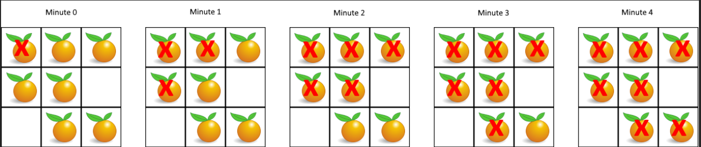

# 200. 岛屿数量
https://leetcode.cn/problems/number-of-islands/?envType=study-plan-v2&envId=top-100-liked
给你一个由 '1'（陆地）和 '0'（水）组成的的二维网格，请你计算网格中岛屿的数量。

岛屿总是被水包围，并且每座岛屿只能由水平方向和/或竖直方向上相邻的陆地连接形成。

此外，你可以假设该网格的四条边均被水包围。


示例 1：

输入：grid = [
['1','1','1','1','0'],
['1','1','0','1','0'],
['1','1','0','0','0'],
['0','0','0','0','0']
]
输出：1
示例 2：

输入：grid = [
['1','1','0','0','0'],
['1','1','0','0','0'],
['0','0','1','0','0'],
['0','0','0','1','1']
]
输出：3


提示：

m == grid.length
n == grid[i].length
1 <= m, n <= 300
grid[i][j] 的值为 '0' 或 '1'

***
表格每个格子看作一个图的节点，记为(i,j),i，j分别是行列坐标

如果两个相邻的节点都是1，意味着这两个节点直接有一条边。

每当读取到一个新的未访问过的1，岛屿数目就加1，遍历和他相邻的所有节点，所有遍历到的节点都记为访问过（可以二维布尔数组，也可以直接原地改为-1）

整体上来说，每个节点都被访问一次。每次访问的各种操作都是O(1)

因此复杂度O(mn)

1. 深度优先遍历

考虑深度优先遍历

```java
class Solution {
    public int numIslands(char[][] grid) {
        int result = 0;
        for (int i = 0; i < grid.length; i++) {
            for (int j = 0; j < grid[0].length; j++) {
                if (grid[i][j] == '1'){
                    result++;
                    dfs(i,j,grid);
                }
            }
        }
        return result;
    }
    private void dfs(int row, int col, char[][] grid){
        if (grid[row][col] == '2' || grid[row][col] == '0'){
            return;
        }
        grid[row][col] = '2';
        int[][] direction = new int[][]{{1,0},{0,1},{-1,0},{0,-1}};
        for (int[] dir : direction) {
            int newRow = row + dir[0];
            int newCol = col + dir[1];
            if (newRow >= 0 && newRow < grid.length && newCol >= 0 && newCol<grid[0].length){
                if (grid[newRow][newCol] == '1'){
                    dfs(newRow,newCol,grid);
                }
            }
        }
    }
}
```

代码逻辑可以优化如下，dfs把判断都放在开头,同时没必要引入'2'这个状态
```java
class Solution {
    public int numIslands(char[][] grid) {
        if (grid == null || grid.length == 0) {
            return 0;
        }
        int result = 0;
        for (int i = 0; i < grid.length; i++) {
            for (int j = 0; j < grid[0].length; j++) {
                if (grid[i][j] == '1') {
                    result++;
                    dfs(i, j, grid);
                }
            }
        }
        return result;
    }

    // 优化后的 DFS 方法
    private void dfs(int row, int col, char[][] grid) {
        // 1. 将所有终止条件（边界检查和格子状态检查）放在函数开头
        // 这样使得递归逻辑更清晰
        if (row < 0 || row >= grid.length || col < 0 || col >= grid[0].length || grid[row][col] != '1') {
            return;
        }

        // 2. 标记当前节点为已访问。可以直接改成'0'，也可以用'2'
        grid[row][col] = '0'; // 或者 '2'

        // 3. 向四个方向递归，循环体内不再需要任何if判断
        dfs(row + 1, col, grid);
        dfs(row - 1, col, grid);
        dfs(row, col + 1, grid);
        dfs(row, col - 1, grid);
    }
}
```
时间O(mn),空间O(mn)(最大岛屿面积mn)
2. 广度优先

```java
import java.util.ArrayDeque;
import java.util.Queue;

class Solution {
    public int numIslands(char[][] grid) {
        int result = 0;
        for (int i = 0; i < grid.length; i++) {
            for (int j = 0; j < grid[0].length; j++) {
                if (grid[i][j] == '1'){
                    result++;
                    bfs(grid,i,j);
                }
            }
        }
        return result;

    }

    private class node{
        char value = '2';
        int row = -1;
        int col = -1;
        public node(char value,int row,int col){
            this.value = value;
            this.col = col;
            this.row = row;
        }
    }
    private void bfs(char[][] grid, int row, int col) {
        Queue<node> queue = new ArrayDeque<>();
        queue.offer(new node(grid[row][col],row,col) );
        grid[row][col] = '0';
        int[][] direction = new int[][]{{1,0},{0,1},{-1,0},{0,-1}};
        while (!queue.isEmpty()){
            node node = queue.poll();
            int rowThisLoop = node.row;
            int colThisLoop = node.col;
            for (int[] dir : direction) {
                int newRow = rowThisLoop + dir[0];
                int newCol = colThisLoop + dir[1];
                if (newRow >= 0 && newRow < grid.length && newCol >= 0 && newCol<grid[0].length){
                    if (grid[newRow][newCol] == '1') {
                        queue.offer(new node(grid[newRow][newCol], newRow, newCol));
                        grid[newRow][newCol] = '0';
                    }
                }
            }
        }
    }
}
```

实际上上面可以不适用node类
```java
import java.util.ArrayDeque;
import java.util.Queue;

class Solution {
    public int numIslands(char[][] grid) {
        if (grid == null || grid.length == 0) {
            return 0;
        }

        int result = 0;
        for (int i = 0; i < grid.length; i++) {
            for (int j = 0; j < grid[0].length; j++) {
                if (grid[i][j] == '1') {
                    result++;
                    bfs(grid, i, j);
                }
            }
        }
        return result;
    }

    private void bfs(char[][] grid, int row, int col) {
        // 队列直接存储坐标数组 int[]{row, col}
        Queue<int[]> queue = new ArrayDeque<>();
        queue.offer(new int[]{row, col});
        grid[row][col] = '0'; // 标记为已访问

        int[][] direction = new int[][]{{1, 0}, {0, 1}, {-1, 0}, {0, -1}};

        while (!queue.isEmpty()) {
            int[] current = queue.poll();
            int rowThisLoop = current[0];
            int colThisLoop = current[1];

            for (int[] dir : direction) {
                int newRow = rowThisLoop + dir[0];
                int newCol = colThisLoop + dir[1];

                if (newRow >= 0 && newRow < grid.length && newCol >= 0 && newCol < grid[0].length) {
                    if (grid[newRow][newCol] == '1') {
                        queue.offer(new int[]{newRow, newCol});
                        grid[newRow][newCol] = '0'; // 标记为已访问
                    }
                }
            }
        }
    }
}
```
时间O(mn),空间O(min(m,n)).画图可得，队列queue是在不断扩散的（一个斜着的正方形），最大是2sqrt(ming(m,n)),因此最终空间复杂度是O(min(m,n))

# 994. 腐烂的橘子
https://leetcode.cn/problems/rotting-oranges/description/?envType=study-plan-v2&envId=top-100-liked
在给定的 m x n 网格 grid 中，每个单元格可以有以下三个值之一：

值 0 代表空单元格；
值 1 代表新鲜橘子；
值 2 代表腐烂的橘子。
每分钟，腐烂的橘子 周围 4 个方向上相邻 的新鲜橘子都会腐烂。

返回 直到单元格中没有新鲜橘子为止所必须经过的最小分钟数。如果不可能，返回 -1 。


示例 1：


输入：grid = [[2,1,1],[1,1,0],[0,1,1]]
输出：4
示例 2：

输入：grid = [[2,1,1],[0,1,1],[1,0,1]]
输出：-1
解释：左下角的橘子（第 2 行， 第 0 列）永远不会腐烂，因为腐烂只会发生在 4 个方向上。
示例 3：

输入：grid = [[0,2]]
输出：0
解释：因为 0 分钟时已经没有新鲜橘子了，所以答案就是 0 。


提示：

m == grid.length
n == grid[i].length
1 <= m, n <= 10
grid[i][j] 仅为 0、1 或 2

***
把每个格子看成一个节点

先遍历，找出所有为2的节点

之后，对于每个为2的节点，只要相邻的是1都认为他们是邻节点，进行第一次腐化，minute加一

把新腐化的节点都放入一个列表。

之后再次腐化循环

直到所有1都被腐化或者没有和2相邻的1

```java
import java.util.ArrayDeque;
import java.util.ArrayList;
import java.util.List;
import java.util.Queue;

class Solution {
    public int orangesRotting(int[][] grid) {
        
        Queue<int[]> rottedOrangesToProcess = new ArrayDeque<>();
        int loop = 0;
        for (int i = 0; i < grid.length; i++) {
            for (int j = 0; j < grid[0].length; j++) {
                if (grid[i][j] == 2) {
                    rottedOrangesToProcess.offer(new int[]{i, j});
                }
            }
        }
        while (!rottedOrangesToProcess.isEmpty()) {
            int size = rottedOrangesToProcess.size();
            for (int i = 0; i < size; i++) {
                int[] place = rottedOrangesToProcess.poll();
                List<int[]> rottedPlace = rot(grid, place[0], place[1]);
                for (int[] newPlace : rottedPlace) {
                    rottedOrangesToProcess.offer(newPlace);
                }
            }
            loop++;
        }
        boolean hasOne = false;
        boolean hasTwo = false;
        boolean hasZero = false;
        for (int i = 0; i < grid.length; i++) {
            for (int j = 0; j < grid[0].length; j++) {
                if (grid[i][j] == 1) {
                    hasOne = true;
                }
                if (grid[i][j] == 2){
                    hasTwo = true;
                }
                if (grid[i][j] == 0){
                    hasZero = true;
                }
            }
        }
        if (hasOne){
            return -1;
        }
        if (hasZero && !hasTwo && !hasOne){
            return 0;
        }
        
        return loop - 1;

    }

    private List<int[]> rot(int[][] grid, int row, int col) {
        List<int[]> rottedPlace = new ArrayList<>();
        int[][] direction = new int[][]{{1, 0}, {0, 1}, {-1, 0}, {0, -1}};
        for (int[] dir : direction) {
            int newRow = row + dir[0];
            int newCol = col + dir[1];
            if (newRow >= 0 && newRow < grid.length && newCol >= 0 && newCol < grid[0].length) {
                if (grid[newRow][newCol] == 1) {
                    grid[newRow][newCol] = 2;
                    rottedPlace.add(new int[]{newRow, newCol});
                }
            }
        }
        return rottedPlace;
    }
}
```
时间复杂度：O(n^2),遍历寻找2花费O(n^2),腐化过程最多访问O(n^2)个节点，每个节点的访问和其他操作都是O(1),最后检查结果也是O(n^2),最终O(n^2)

空间复杂度：主要是队列，这个队列最差O(m*n)。比如如下情况
```
2 1 2 1 2 1 ...
1 2 1 2 1 2 ...
2 1 2 1 2 1 ...
1 2 1 2 1 2 ...
...
```
只有在只有一个起点的时候，复杂度才是O(min(m,n)).

实际上上面的解法是个多源起点的BFS。

上面的代码可以优化。可以寻找2的时候记录1和0的个数。之后每次腐化一个节点1的个数就减少rottedPlace.size()。最终1，0的数据获取不必再次遍历。但是复杂度不变。

同时Loop的返回可以优化

```java
import java.util.ArrayDeque;
import java.util.Queue;

class Solution {
    public int orangesRotting(int[][] grid) {
        int m = grid.length;
        int n = grid[0].length;
        Queue<int[]> queue = new ArrayDeque<>();
        int freshCount = 0;

        // 步骤 1: 第一次遍历，统计新鲜橘子并将腐烂橘子入队
        for (int i = 0; i < m; i++) {
            for (int j = 0; j < n; j++) {
                if (grid[i][j] == 1) {
                    freshCount++;
                } else if (grid[i][j] == 2) {
                    queue.offer(new int[]{i, j});
                }
            }
        }

        // 步骤 2: 处理边界情况
        if (freshCount == 0) {
            return 0;
        }

        int minutes = 0;
        int[][] directions = {{1, 0}, {-1, 0}, {0, 1}, {0, -1}};

        // 步骤 3: BFS 过程
        while (!queue.isEmpty()) {
            // 增加 minutes 的时机很关键。
            // 上面本来的解法会导致即使最后一轮没有腐烂任何橘子，时间也会+1。
            // 所以更好的方式是，引入判断rottedInThisMinute，只有本轮有橘子腐烂才minute+1
            // 如果队列处理完后 freshCount > 0，则说明无法完成。
            
            int size = queue.size();
            boolean rottedInThisMinute = false;
            for (int i = 0; i < size; i++) {
                int[] current = queue.poll();
                for (int[] dir : directions) {
                    int newRow = current[0] + dir[0];
                    int newCol = current[1] + dir[1];

                    if (newRow >= 0 && newRow < m && newCol >= 0 && newCol < n && grid[newRow][newCol] == 1) {
                        grid[newRow][newCol] = 2;
                        freshCount--;
                        queue.offer(new int[]{newRow, newCol});
                        rottedInThisMinute = true;
                    }
                }
            }
            
            // 如果在这一分钟内有新的橘子被腐烂，时间才加一
            if (rottedInThisMinute) {
                minutes++;
            }
        }

        // 步骤 4: 返回最终结果
        return freshCount <= 0 ? minutes : -1;
    }
}
```