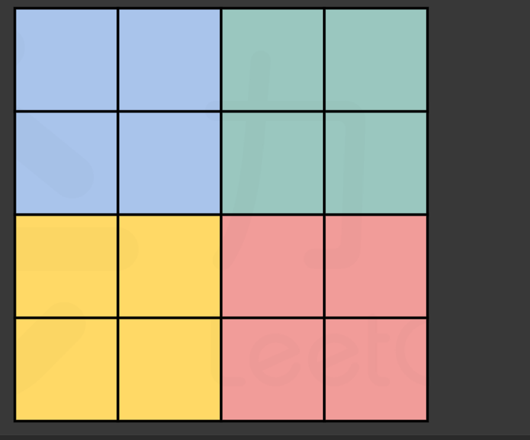
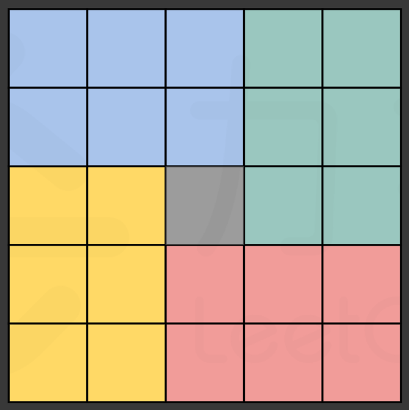

# 73. 矩阵置零
给定一个 m x n 的矩阵，如果一个元素为 0 ，则将其所在行和列的所有元素都设为 0 。请使用 原地 算法。


示例 1：


输入：matrix = [[1,1,1],[1,0,1],[1,1,1]]
输出：[[1,0,1],[0,0,0],[1,0,1]]
示例 2：


输入：matrix = [[0,1,2,0],[3,4,5,2],[1,3,1,5]]
输出：[[0,0,0,0],[0,4,5,0],[0,3,1,0]]


提示：

m == matrix.length
n == matrix[0].length
1 <= m, n <= 200
-231 <= matrix[i][j] <= 231 - 1


进阶：

一个直观的解决方案是使用  O(mn) 的额外空间，但这并不是一个好的解决方案。
一个简单的改进方案是使用 O(m + n) 的额外空间，但这仍然不是最好的解决方案。
你能想出一个仅使用常量空间的解决方案吗？


一个想法就是依次遍历，遇到为0的元素就开始遍历对应每一行每一列并赋值为0，期间如果遇到其他为0的元素就先标记，但这样会导致复杂度至少是O(m+n).就先把这个对应的行列赋值为0。需要使用递归，空间复杂度O(m+n)。在想能不能转换成迭代，降低空间复杂度到O(1)。没想到怎么搞

下面是官方题解

1. 标记数组
使用两个数组，分别标记行列。首先遍历一次表格。如果出现了一个0，就记录他的行列索引为true。

之后再次遍历表格，把对应的行列索引设置为0.

```java
class Solution {
    public void setZeroes(int[][] matrix) {
        int m = matrix.length;//行数
        int n = matrix[0].length;//列数
        boolean[] row = new boolean[m];
        boolean[] col = new boolean[n];
        for (int i = 0; i < m; i++) {
            for (int j = 0; j < n; j++) {
                if (matrix[i][j] == 0 ){
                    row[i] = true;
                    col[j] = true;
                }
            }
        }
        for (int i = 0; i < m; i++) {
            for (int j = 0; j < n; j++) {
                if (row[i] || col[j]){
                    matrix[i][j] = 0;
                }
            }
        }
        
    }
}
```
时间复杂度O(mn),空间复杂度O(m+n)

2.  使用两个标记变量
上面的方法空间复杂度高主要在于使用了两个数组进行标记。

可以考虑直接使用矩阵的第一行或者第一列来进行标记。（遍历矩阵，遇到为零的元素就把对应的行列的首元素归0来记录（本来只要有这个情况也就要把此元素归零）

但是这样的话，无法判定首行是否有0.考虑使用两个变量来记录。主要首行或首列有0，最终首行或首列就要归零
```java
class Solution {
    public void setZeroes(int[][] matrix) {
        boolean firstRowZeroFlag = false;
        boolean firstColZeroFlag = false;
        int m = matrix.length;//行数
        int n = matrix[0].length;//列数
        for (int i = 0; i < n; i++) {
            if (matrix[0][i] == 0){//首行出现了0
                firstRowZeroFlag = true;
                break;
            }
        }
        for (int i = 0; i < m; i++) {
            if (matrix[i][0] == 0){//首列出现了0
                firstColZeroFlag = true;
                break;
            }
        }
        for (int i = 1; i < m; i++) {
            for (int j = 1; j < n; j++) {
                if (matrix[i][j] == 0){
                    matrix[i][0] = 0;
                    matrix[0][j] = 0;
                }
            }
        }
        for (int i = 1; i < m; i++) {
            for (int j = 1; j < n; j++) {
                if (matrix[i][0] == 0 || matrix[0][j] == 0){
                    matrix[i][j] = 0;
                }
            }
        }
        if (firstRowZeroFlag){
            for (int i = 0; i < n; i++) {
                matrix[0][i] = 0;
            }
        }
        if (firstColZeroFlag){
            for (int i = 0; i < m; i++) {
                matrix[i][0] = 0;
            }
        }
    }
}
```


3. 使用第一列来记录

上面方法可以进一步优化。只用一个临时变量来记录第一列有无0，使用（0，0）处元素记录第一行有没有0.

```java
class Solution {
    public void setZeroes(int[][] matrix) {
        int m = matrix.length;//行数
        int n = matrix[0].length;//列数
        boolean col0ZeroFlag = false;
        for (int i = 0; i < m; i++) {
            if (matrix[i][0] == 0){
                col0ZeroFlag = true;
                break;
            }
        }
        for (int i = 0; i < n; i++) {
            if (matrix[0][i]){
                matrix[0][0] = 0;
                break;
            }
        }
        for (int i = 1; i < m; i++) {
            for (int j = 1; j < n; j++) {
                if (matrix[i][j] == 0){
                    matrix[i][0] = 0;
                    matrix[0][j] = 0;
                }
            }
        }
        for (int i = 1; i < m; i++) {
            for (int j = 1; j < n; j++) {
                if (matrix[i][0] == 0 || matrix[0][j] == 0){
                    matrix[i][j] = 0;
                }
            }
        }
        if (matrix[0][0] == 0){
            for (int i = 0; i < n; i++) {
                matrix[0][i] = 0;
            }
        }
        if (col0ZeroFlag == 0){
            for (int i = 0; i < m; i++) {
                matrix[i][0] = 0;
            }
        }

    }
}
```

时间复杂度:O(mn),空间复杂度O(1)


# 54.螺旋矩阵
给你一个 m 行 n 列的矩阵 matrix ，请按照 顺时针螺旋顺序 ，返回矩阵中的所有元素。

https://leetcode.cn/problems/spiral-matrix/description/?envType=study-plan-v2&envId=top-100-liked

一个想法是，建立一个布尔二维矩阵储存每个元素是否被访问过。同时使用一个count记录被遍历过的元素个数。遍历的时候如果发现下一个元素越界或者被访问过，就根据改变方向。用一个变量status记录当前移动的状态，如果本来是向左就改成向下，本来是向下就改成向左，本来是向左就改成向上，本来是向上就改成向右。count等于mn时停止。

这个 时间复杂度应该是O(mn),空间也是O(mn)

这个方法即为力扣官方题解的方法一

```java
import java.util.ArrayList;
import java.util.List;

class Solution {
    public List<Integer> spiralOrder(int[][] matrix) {
        int m = matrix.length;
        int n = matrix[0].length;
        boolean[][] visited = new boolean[m][n];
        int count = 0;
        char status = 'r';
        List<Integer> result = new ArrayList<>();
        int row = 0;
        int col = 0;
        while (count < m*n){
            result.add(matrix[row][col]);
            count++;
            visited[row][col] = true;
            if (status == 'r'){
                col++;
            } else if (status == 'd') {
                row++;
            }else if (status == 'l'){
                col--;
            } else if (status == 'u') {
                row--;
            }
            if (row >= m || row < 0 ||col < 0 || col >= n || visited[row][col] ){
                if (status == 'r'){
                    col--;
                } else if (status == 'd') {
                    row--;
                }else if (status == 'l'){
                    col++;
                } else if (status == 'u') {
                    row++;
                }
                status = change(status);
                if (status == 'r'){
                    col++;
                } else if (status == 'd') {
                    row++;
                }else if (status == 'l'){
                    col--;
                } else if (status == 'u') {
                    row--;
                }

            }

        }
        return result;
    }
    private char change(char c){
        if (c == 'r'){
            return  'd';
        } else if (c == 'd') {
            return  'l';
        } else if (c == 'l') {
            return  'u';
        } else if (c == 'u') {
            return  'r';
        }
        return 'x';
    }
}
```
注意:
1. Character等包装类都是不可变得，在change方法里面执行c = 'd'实际上自动装箱执行了c = Character.Valueof('d')，创建了个新的对象

下面是这种思路的标准解法：
1. 使用方向数组代替方向
2. 先探索下一步是否可以

```java
class Solution {
    public List<Integer> spiralOrder(int[][] matrix) {
        int m = matrix.length;
        int n = matrix[0].length;
        boolean[][] visited = new boolean[m][n];
        int total = m * n;
        List<Integer> result = new ArrayList<>();

        // directions    [0] -> 右, [1] -> 下, [2] -> 左, [3] -> 上 正好是这样，右转到下，下转左，左转上，上转右
        int[][] directions = {{0, 1}, {1, 0}, {0, -1}, {-1, 0}};
        int directionIndex = 0;
        
        int row = 0;
        int col = 0;

        while (result.size() < total) {
            // 1. 添加当前元素
            result.add(matrix[row][col]);
            visited[row][col] = true;

            // 2. 计算按当前方向的下一步
            int nextRow = row + directions[directionIndex][0];
            int nextCol = col + directions[directionIndex][1];

            // 3. 判断是否需要转向
            if (nextRow < 0 || nextRow >= m || nextCol < 0 || nextCol >= n || visited[nextRow][nextCol]) {
                directionIndex = (directionIndex + 1) % 4; // 转向。正好是这样，右转到下，下转左，左转上，上转右
            }

            // 4. 移动到真正的下一步（如果还没遍历完）
            if (result.size() < total) {
                row += directions[directionIndex][0];
                col += directions[directionIndex][1];
            }
        }
        return result;
    }
}
```


2. 按层模拟

定义四个变量表示当前要遍历的矩阵部分的边界：top,bottom,left,right

初始top为0，bottom 为 m-1,left为0，right为n-1

开启循环，条件是top <= bottom,left <= right

每个循环执行四步：
1. 从左到右:(top,left) -> (top,right)
2. 从上到下：(top + 1,right) -> (bottom,right)
3. 从右到左:(bottom,right - 1)->(bottom,left)
4. 从下到上:(bottom + 1,left) ->(top,left)
5. 之后top++,bottom--,left++,right--

```java
import java.util.ArrayList;
import java.util.List;

class Solution {
    public List<Integer> spiralOrder(int[][] matrix) {
        int m = matrix.length;//行数
        int n = matrix[0].length;//列数
        int top = 0;
        int bottom = m - 1;
        int left = 0;
        int right = n - 1;
        List<Integer> result = new ArrayList<>();
        while (top <= bottom && left <= right) {
            int i = left;
            while (i <= right) {
                result.add(matrix[top][i]);
                i++;
            }
            int j = top + 1;
            while (j <= bottom){
                result.add(matrix[j][right]);
                j++;
            }
            int a = right - 1;
            while (a >= left){
                result.add(matrix[bottom][a]);
                a--;
            }
            int b = bottom + 1;
            while (b >= top){
                result.add(matrix[b][left]);
                b--;
            }
        }
        return result;
    }
}
```


# 48.旋转图像

给定一个 n × n 的二维矩阵 matrix 表示一个图像。请你将图像顺时针旋转 90 度。

你必须在 原地 旋转图像，这意味着你需要直接修改输入的二维矩阵。请不要 使用另一个矩阵来旋转图像。


示例 1：


输入：matrix = [[1,2,3],[4,5,6],[7,8,9]]
输出：[[7,4,1],[8,5,2],[9,6,3]]
示例 2：


输入：matrix = [[5,1,9,11],[2,4,8,10],[13,3,6,7],[15,14,12,16]]
输出：[[15,13,2,5],[14,3,4,1],[12,6,8,9],[16,7,10,11]]


提示：

n == matrix.length == matrix[i].length
1 <= n <= 20
-1000 <= matrix[i][j] <= 1000
 

一个思考：计算得(i,j)(i行j列)的元素旋转后移动到(j,-i+l-1)。(这个规律最好观察得到)

考虑遍历表格，每个元素覆盖到它的对应的元素，使用一个数组记录（使用一个一维数组记录即可，我们分行遍历，每一行只会对应一列元素）.实际上不行，先用一个二维表格记录吧
时间复杂度O(n^2).空间O(n^2)

```java
class Solution {
    public void rotate(int[][] matrix) {
        int n = matrix.length;
        int[][] temp = new int[n][n];
        for (int i = 0; i < n; i++) {
            for (int j = 0; j < n; j++) {
                temp[i][j] = matrix[i][j];
            }
        }
        
        for (int i = 0; i < n; i++) {
            for (int j = 0; j < n; j++) {
                int i_1 = j;
                int j_1 = -i + n - 1;
                matrix[i_1][j_1] = temp[i][j];                
            }
        }
        
    }
}
```

上面的解法有点问题，空间复杂度不对

下面方法
2. 原地旋转

(i,j) -> (j,-i + l -1)。不能直接赋值的关键在于(j,-i+l-1)会被覆盖。可以考虑用temp储存。

但是如果用temp储存，如果想上面按照的顺序遍历，无法知道遍历到的元素是否是被替换过的

因此最好一次从某个元素为起点开始旋转，直到旋转回起点，四次即可。

(i,j)->(j,-i+l-1)->(-i+l-1,-j+l-1)->(-j+l-1,i-l+1+l-1 = i)->(i,j-l+1+l-1 = j)

因此，实际上就是，依次把元素覆盖。使用temp储存(i,j),(i,j) = (-j+l-1,i),(-j+l-1,i) = (-i+l-1,-j+l-1),(-i+l-1,-j+l-1) = (j,-i+l-1)，(j,-i+l-1) = temp

那么遍历几个元素就可以呢

当n为偶数

分为四个区域，遍历其中一个区域即可，也就是一个(n/2,n/2)的矩阵

当n为奇数

也是分为四个区域，每个区域是((n-1)/2,(n+1)/2)矩阵

实际上实现时候，行数遍历(n/2)(如果n是奇数，相当于(n-1)/2),列数遍历((n+1)/2)，多一个也没啥
```java
class Solution {
    public void rotate(int[][] matrix) {
        int n = matrix.length;
        for (int i = 0; i < n / 2; i++) {
            for (int j = 0; j < (n + 1) / 2; j++) {
                int temp = matrix[i][j];
                matrix[i][j] = matrix[-j+n-1][i];
                matrix[-j+n-1][i] = matrix[-i+n-1][-j+n-1];
                matrix[-i+n-1][-j+n-1] = matrix[j][-i+n-1];
                matrix[j][-i+n-1] = temp;
            }
        }
    }
}
```

3. 翻转代替旋转

(i,j) ->(j,-i+n-1),可以通过两次翻转得到

先水平轴翻转，(i,j)->(n-1-i,j),在主对角线(i =j)翻转，(n-1-i,j) -> (j,n-1-i)

```java
class Solution {
    public void rotate(int[][] matrix) {
        int n = matrix.length;
        //水平翻转
        for (int i = 0; i < n / 2; i++) {//注意：水平翻转，所以 行数遍历一般即可
            for (int j = 0; j < n; j++) {
                int temp = matrix[i][j];
                matrix[i][j] = matrix[n-1-i][j];
                matrix[n-1-i][j] = temp;
            }
        }
        
        //主对角线翻转
        for (int i = 0; i < n; i++) {
            for (int j = 0; j < i; j++) {
                int temp = matrix[i][j];
                matrix[i][j] = matrix[j][i];
                matrix[j][i] = temp;
            }
        }
    }
}
```
时间复杂度O(n^2),空间O(1)