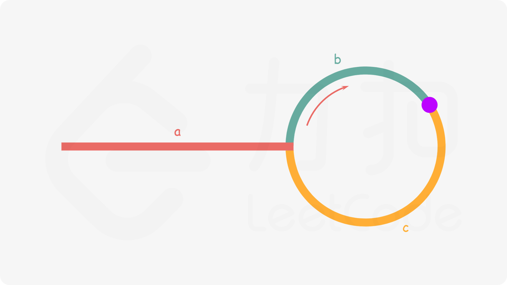

# 160.相交链表
https://leetcode.cn/problems/intersection-of-two-linked-lists/description/?envType=study-plan-v2&envId=top-100-liked
给你两个单链表的头节点 headA 和 headB ，请你找出并返回两个单链表相交的起始节点。如果两个链表不存在相交节点，返回 null 。

图示两个链表在节点 c1 开始相交：


题目数据 保证 整个链式结构中不存在环。

注意，函数返回结果后，链表必须 保持其原始结构 。

自定义评测：

评测系统 的输入如下（你设计的程序 不适用 此输入）：

intersectVal - 相交的起始节点的值。如果不存在相交节点，这一值为 0
listA - 第一个链表
listB - 第二个链表
skipA - 在 listA 中（从头节点开始）跳到交叉节点的节点数
skipB - 在 listB 中（从头节点开始）跳到交叉节点的节点数
评测系统将根据这些输入创建链式数据结构，并将两个头节点 headA 和 headB 传递给你的程序。如果程序能够正确返回相交节点，那么你的解决方案将被 视作正确答案 。


示例 1：


输入：intersectVal = 8, listA = [4,1,8,4,5], listB = [5,6,1,8,4,5], skipA = 2, skipB = 3
输出：Intersected at '8'
解释：相交节点的值为 8 （注意，如果两个链表相交则不能为 0）。
从各自的表头开始算起，链表 A 为 [4,1,8,4,5]，链表 B 为 [5,6,1,8,4,5]。
在 A 中，相交节点前有 2 个节点；在 B 中，相交节点前有 3 个节点。
— 请注意相交节点的值不为 1，因为在链表 A 和链表 B 之中值为 1 的节点 (A 中第二个节点和 B 中第三个节点) 是不同的节点。换句话说，它们在内存中指向两个不同的位置，而链表 A 和链表 B 中值为 8 的节点 (A 中第三个节点，B 中第四个节点) 在内存中指向相同的位置。


示例 2：


输入：intersectVal = 2, listA = [1,9,1,2,4], listB = [3,2,4], skipA = 3, skipB = 1
输出：Intersected at '2'
解释：相交节点的值为 2 （注意，如果两个链表相交则不能为 0）。
从各自的表头开始算起，链表 A 为 [1,9,1,2,4]，链表 B 为 [3,2,4]。
在 A 中，相交节点前有 3 个节点；在 B 中，相交节点前有 1 个节点。
示例 3：


输入：intersectVal = 0, listA = [2,6,4], listB = [1,5], skipA = 3, skipB = 2
输出：No intersection
解释：从各自的表头开始算起，链表 A 为 [2,6,4]，链表 B 为 [1,5]。
由于这两个链表不相交，所以 intersectVal 必须为 0，而 skipA 和 skipB 可以是任意值。
这两个链表不相交，因此返回 null 。


提示：

listA 中节点数目为 m
listB 中节点数目为 n
1 <= m, n <= 3 * 104
1 <= Node.val <= 105
0 <= skipA <= m
0 <= skipB <= n
如果 listA 和 listB 没有交点，intersectVal 为 0
如果 listA 和 listB 有交点，intersectVal == listA[skipA] == listB[skipB]


进阶：你能否设计一个时间复杂度 O(m + n) 、仅用 O(1) 内存的解决方案？

一个想法：分别遍历AB，使用一个Set保存遍历过的节点。如果某次遍历得到的节点在Set里，就是第一个相交的节点。如果某个链表遍历到尾部，则没有相交节点。

时间复杂度O(m+n),空间O(m)

```java
import java.util.HashSet;
import java.util.Set;

/**
 * Definition for singly-linked list.
 * public class ListNode {
 *     int val;
 *     ListNode next;
 *     ListNode(int x) {
 *         val = x;
 *         next = null;
 *     }
 * }
 */

 public class ListNode {
      int val;
      ListNode next;
      ListNode(int x) {
          val = x;
          next = null;
      }
  }

public class Solution {
    public ListNode getIntersectionNode(ListNode headA, ListNode headB) {
        ListNode cur_a = headA;
        ListNode cur_b = headB;
        Set<ListNode> set = new HashSet<>();
        while (cur_a != null){
            set.add(cur_a);
            cur_a = cur_a.next;
        }
        while (cur_b != null){
            if (set.contains(cur_b)){
                return cur_b;
            }
            set.add(cur_b);
            cur_b = cur_b.next;
        }
        return null;
    }
}
```

进阶:
双指针。
p_a,和p_b。

同时移动两个指针：
* 如果某个指针为空，比如p_a为空，则把p_a指向b的开头
* 当两个指针都为空或者指向同一个节点，则返回这个相交节点或者null

实际上，就是两个指针都要遍历两个链表。
* 如果两个链表有交点，相交后的长度记为l，则p_a遍历了skip_a + l + skip_b,p_b遍历了skip_b + l + skip_a,两个指针肯定会某个时间指向同一个
* 如果没有交点，则都遍历l_a + l_b，最终同时为null

时间复杂度O(m + n),空间O(1)

```java
/**
 * Definition for singly-linked list.
 * public class ListNode {
 *     int val;
 *     ListNode next;
 *     ListNode(int x) {
 *         val = x;
 *         next = null;
 *     }
 * }
 */

public class ListNode {
    int val;
    ListNode next;
    ListNode(int x) {
        val = x;
        next = null;
    }
}

public class Solution {
    public ListNode getIntersectionNode(ListNode headA, ListNode headB) {
        ListNode p_a = headA;
        ListNode p_b = headB;
        while (true){
            if (p_a == p_b){
                return p_a;
            }
            p_a = p_a == null ? headB : p_a.next;// 如果用if来写，注意要使用else，防止在p_a为null时，直接把p_a移动到了p_a.next
            p_b = p_b == null ? headA : p_b.next;
        }
    }
}
```
# 206.翻转链表
给你单链表的头节点 head ，请你反转链表，并返回反转后的链表。


示例 1：


输入：head = [1,2,3,4,5]
输出：[5,4,3,2,1]
示例 2：


输入：head = [1,2]
输出：[2,1]
示例 3：

输入：head = []
输出：[]


提示：

链表中节点的数目范围是 [0, 5000]
-5000 <= Node.val <= 5000


进阶：链表可以选用迭代或递归方式完成反转。你能否用两种方法解决这道题？

1. 递归
遍历找到最后一个，headNew = 最后一个

基本情况：节点数量是1，即head.next == nul，直接返回

本层问题：cur = head,next = cur.next,next_next = next.next,next.next = cur

递归处理：next_next以及之后的

最后 next_next.next = cur.

时间复杂度：O(n),空间复杂度O(n)

```java
/**
 * Definition for singly-linked list.
 * public class ListNode {
 *     int val;
 *     ListNode next;
 *     ListNode() {}
 *     ListNode(int val) { this.val = val; }
 *     ListNode(int val, ListNode next) { this.val = val; this.next = next; }
 * }
 */

public class ListNode {
     int val;
     ListNode next;
     ListNode() {}
     ListNode(int val) { this.val = val; }
     ListNode(int val, ListNode next) { this.val = val; this.next = next; }
 }

class Solution {
    public ListNode reverseList(ListNode head) {
        if (head == null || head.next ==null){
            return head;
        }
        ListNode cur = head;
        while (cur.next != null){
            cur = cur.next;
        }
        ListNode headNew = cur;
        reverseListReverse(head);
        return headNew;
    }
    private void reverseListReverse(ListNode head){
        if (head.next == null){
            return;
        }
        if (head.next.next == null) {
            ListNode cur = head;
            ListNode next = cur.next;
            cur.next = null;
            next.next = cur;
            return;
        }
        ListNode cur = head;
        ListNode next = cur.next;
        ListNode next_next = next.next;
        cur.next = null;
        next.next = cur;
        reverseListReverse(next_next);
        next_next.next = next;

    }
}
```
上面解法是可以的。

但最好的还是

**先翻转head之后的链表。**

**之后让head.next指向head并把head.next赋值为null**

```java
/**
 * Definition for singly-linked list.
 * public class ListNode {
 *     int val;
 *     ListNode next;
 *     ListNode() {}
 *     ListNode(int val) { this.val = val; }
 *     ListNode(int val, ListNode next) { this.val = val; this.next = next; }
 * }
 */

public class ListNode {
    int val;
    ListNode next;
    ListNode() {}
    ListNode(int val) { this.val = val; }
    ListNode(int val, ListNode next) { this.val = val; this.next = next; }
}


class Solution {
    public ListNode reverseList(ListNode head) {
        if (head == null || head.next == null){
            return head;
        }
        ListNode headNew = reverseList(head.next);
        head.next.next = head;
        head.next = null;
        return headNew;
    }
}
```

2. 迭代

对遍历，对每个节点执行操作。cur和prev记录当前和上一个。Listnode next = cur.next,(防止覆盖）cur.next = prev,prev = cur,cur = cur.next.直到cur为null，prev为此时头节点
```java
/**
 * Definition for singly-linked list.
 * public class ListNode {
 *     int val;
 *     ListNode next;
 *     ListNode() {}
 *     ListNode(int val) { this.val = val; }
 *     ListNode(int val, ListNode next) { this.val = val; this.next = next; }
 * }
 */


public class ListNode {
    int val;
    ListNode next;
    ListNode() {}
    ListNode(int val) { this.val = val; }
    ListNode(int val, ListNode next) { this.val = val; this.next = next; }
}


class Solution {
    public ListNode reverseList(ListNode head) {
        ListNode cur = head;
        ListNode prev = null;
        while (cur != null){
            ListNode next = cur.next;
            cur.next = prev;
            prev = cur;
            cur =next;
        }
        return prev;
    }
}
```
时间复杂度O(n),空间O(1)

# 234.回文链表
给你一个单链表的头节点 head ，请你判断该链表是否为回文链表。如果是，返回 true ；否则，返回 false 。


示例 1：


输入：head = [1,2,2,1]
输出：true
示例 2：


输入：head = [1,2]
输出：false


提示：

链表中节点数目在范围[1, 105] 内
0 <= Node.val <= 9


进阶：你能否用 O(n) 时间复杂度和 O(1) 空间复杂度解决此题？

一个想法是，先正向遍历，用一个数组记录。之后把它逆转（其实把数组逆转就行，也可以使用双指针不去逆转数组）。再次遍历记录到一个数组。最后比较两个数组

时间复杂度O(n),空间复杂度O(n).

下面用双指针

```java
import java.util.ArrayList;
import java.util.List;

class ListNode {
    int val;
    ListNode next;

    ListNode() {
    }

    ListNode(int val) {
        this.val = val;
    }

    ListNode(int val, ListNode next) {
        this.val = val;
        this.next = next;
    }
}

class Solution {
    public boolean isPalindrome(ListNode head) {
        List<Integer> temp = new ArrayList<>();
        ListNode cur = head;
        while (cur != null){
            temp.add(cur.val);
            cur = cur.next;
        }
        int left = 0;
        int right = temp.size() - 1;
        while (left < right){
            if (temp.get(left) != temp.get(right)){
                return false;
            }
            left++;
            right--;
        }
        return true;
    }
}
```

为什么要这样转成数组？

数组可以O(1)任意访问，链表不可以。正向反向都是O(n)。想要访问最后一个元素，倒数第二个，倒数第三个都需要一次遍历到

我们可以使用递归倒叙遍历
```
function print_values_in_reverse(ListNode head)
    if head is NOT null
        print_values_in_reverse(head.next)
        print head.val
```
实现的话，frontPointer来作为从前向后遍历的指针，curNode作为从后向前遍历的指针。递归调用栈依然是O(n),时间复杂度也是O(n),因为用了递归实际上比上面解法更差
```java
class ListNode {
    int val;
    ListNode next;

    ListNode() {
    }

    ListNode(int val) {
        this.val = val;
    }

    ListNode(int val, ListNode next) {
        this.val = val;
        this.next = next;
    }
}
class Solution{
    private ListNode frontPointer;
    private boolean recursivelyCheck(ListNode curNode){
        if (curNode == null){
            //基本情况，默认为true
            return true;
        }
        boolean isInnerPartPalindrome = recursivelyCheck(curNode.next);//递归调用，判断之前的是不是回文
        if (isInnerPartPalindrome == false){
            //如果以前已经不是，直接false
            return false;
        }
        //判断本层
        ListNode frontCur = frontPointer;
        frontPointer = frontPointer.next;
        return frontCur.val == curNode.val;
    }
    public boolean isPalindrome(ListNode head){
        frontPointer = head;
        return recursivelyCheck(head);
    }
}
```
3. 满足进阶要求的方法

其实只要把后半段链表翻转，之后和前半段链表比较即可。

可以先遍历一遍计算节点个数，但更好的是使用快慢指针，慢指针一次走一步，快指针一次走两步，快指针到末尾（无法再向后走两步），慢指针就到了前半部分链表的末尾。

如果是奇数个，中间的节点认为是前半部分的末尾。

把后半部分节点进行翻转

之后开始比较即可,注意后半部分为空就停止，这样可以避免比较中心节点

最好的话最后把后半部分再翻转回来

```java
import java.util.List;

class ListNode {
    int val;
    ListNode next;

    ListNode() {
    }

    ListNode(int val) {
        this.val = val;
    }

    ListNode(int val, ListNode next) {
        this.val = val;
        this.next = next;
    }
}

class Solution {
    public boolean isPalindrome(ListNode head) {
        if (head == null || head.next == null ){
            return true;
        }
        ListNode endOfFirstListPointer = endOfFirstList(head);
        ListNode startOfLastListReversedListPointer = reverse(endOfFirstListPointer.next);
        ListNode firstPointer = head;
        ListNode lastPointer = startOfLastListReversedListPointer;
        while (lastPointer != null){
            if (firstPointer.val != lastPointer.val){
                return false;
            }
            firstPointer = firstPointer.next;
            lastPointer = lastPointer.next;
        }
        ListNode startOfLastListRightOrder = reverse(startOfLastListReversedListPointer);
        return true;
    }

    private ListNode reverse(ListNode head) {
        ListNode cur = head;
        ListNode prev = null;
        while (cur != null){
            ListNode next = cur.next;
            cur.next = prev;
            prev = cur;
            cur = next;
        }
        return prev;
    }
    
    private ListNode endOfFirstList(ListNode head){
        ListNode slow = head;
        ListNode fast = head;
        while (fast.next != null && fast.next.next != null){//检查fast即可，要先检查fast.next是否是null
            slow = slow.next;
            fast = fast.next.next;
        }
        return slow;
    }
}
```

# 141.环形链表
https://leetcode.cn/problems/linked-list-cycle/description/?envType=study-plan-v2&envId=top-100-liked
给你一个链表的头节点 head ，判断链表中是否有环。

如果链表中有某个节点，可以通过连续跟踪 next 指针再次到达，则链表中存在环。 为了表示给定链表中的环，评测系统内部使用整数 pos 来表示链表尾连接到链表中的位置（索引从 0 开始）。注意：pos 不作为参数进行传递 。仅仅是为了标识链表的实际情况。

如果链表中存在环 ，则返回 true 。 否则，返回 false 。


示例 1：


输入：head = [3,2,0,-4], pos = 1
输出：true
解释：链表中有一个环，其尾部连接到第二个节点。
示例 2：


输入：head = [1,2], pos = 0
输出：true
解释：链表中有一个环，其尾部连接到第一个节点。
示例 3：


输入：head = [1], pos = -1
输出：false
解释：链表中没有环。


提示：

链表中节点的数目范围是 [0, 104]
-105 <= Node.val <= 105
pos 为 -1 或者链表中的一个 有效索引 。


进阶：你能用 O(1)（即，常量）内存解决此问题吗？

想法：一个简单的想法就是一直遍历链表使用一个Set储存遍历过的，如果有重复就有环。时空复杂度都是O(n).
```java
import java.util.HashSet;
import java.util.Set;

/**
 * Definition for singly-linked list.
 * class ListNode {
 *     int val;
 *     ListNode next;
 *     ListNode(int x) {
 *         val = x;
 *         next = null;
 *     }
 * }
 */
  class ListNode {
      int val;
      ListNode next;
      ListNode(int x) {
          val = x;
          next = null;
      }
  }

public class Solution {
    public boolean hasCycle(ListNode head) {
        Set<ListNode> temp = new HashSet<>();
        ListNode cur = head;
        while (cur != null){
            if (temp.contains(cur)){
                return true;
            }
            temp.add(cur);
            cur=cur.next;
        }
        return false;
    }
}
```

**O(1)** 复杂度方法：快慢指针

slow一次走一步，fast一次走两步，如果有环两者必定某次相遇，如果没有环则两者始终无法相遇。（fast相对于slow相对速度是1，因此必定能相遇）
```java
class ListNode {
  int val;
  ListNode next;
  ListNode(int x) {
      val = x;
      next = null;
  }
}

public class Solution{
    public boolean hasCycle(ListNode head){
        if (head == null || head.next == null ||head.next.next == null){
            return false;
        }
        ListNode slow = head;
        ListNode fast = head;
        do{
            if (fast == null || fast.next == null){
                return false;
            }
            slow = slow.next;
            fast = fast.next.next;
        }while (slow != fast);
        return true;
    }
}
```

# 142.环形链表二
https://leetcode.cn/problems/linked-list-cycle-ii/description/?envType=study-plan-v2&envId=top-100-liked
给定一个链表的头节点  head ，返回链表开始入环的第一个节点。 如果链表无环，则返回 null。

如果链表中有某个节点，可以通过连续跟踪 next 指针再次到达，则链表中存在环。 为了表示给定链表中的环，评测系统内部使用整数 pos 来表示链表尾连接到链表中的位置（索引从 0 开始）。如果 pos 是 -1，则在该链表中没有环。注意：pos 不作为参数进行传递，仅仅是为了标识链表的实际情况。

不允许修改 链表。


示例 1：


输入：head = [3,2,0,-4], pos = 1
输出：返回索引为 1 的链表节点
解释：链表中有一个环，其尾部连接到第二个节点。
示例 2：


输入：head = [1,2], pos = 0
输出：返回索引为 0 的链表节点
解释：链表中有一个环，其尾部连接到第一个节点。
示例 3：


输入：head = [1], pos = -1
输出：返回 null
解释：链表中没有环。


提示：

链表中节点的数目范围在范围 [0, 104] 内
-105 <= Node.val <= 105
pos 的值为 -1 或者链表中的一个有效索引


进阶：你是否可以使用 O(1) 空间解决此题？

一个想法：不考虑O(1)空间的话很简单，，遍历，用Set记录，遇到第一个 重复的，就是进入环的节点，如果一直到null都没有重复就是没有环

如果还考虑快慢指针，相遇节点不一定是环的起点。

```java
import java.util.HashSet;
import java.util.Set;

/**
 * Definition for singly-linked list.
 * class ListNode {
 *     int val;
 *     ListNode next;
 *     ListNode(int x) {
 *         val = x;
 *         next = null;
 *     }
 * }
 */
class ListNode {
    int val;
    ListNode next;

    ListNode(int x) {
        val = x;
        next = null;
    }
}

public class Solution {
    public ListNode detectCycle(ListNode head) {
        Set<ListNode> temp = new HashSet<>();
        ListNode cur = head;
        while (cur != null){
            if (temp.contains(cur)){
                return cur;
            }
            temp.add(cur);
            cur=cur.next;
        }
        return null;
    }
}
```
**O(1)** 解法：快慢指针。

仿照上题，利用快慢指针判断有无环。



如图，设相遇时fast走了n圈，则有fast总距离是a+n(b+c)+b

fast路程总是slow的两倍。所以a+n(b+c)+b = 2(a+b)   (慢指针只能走不到一圈，相对速度是1，相对距离小于一圈，时间小于走过一圈的时间)

所以a = (n-1)b+nc = c+(n-1)(b+c)

也就是说环起点距离head距离是相遇点距离环起点距离加上n-1圈

因此使用一个新的指针从head开始向前，slow正常运动，最后一定再环起点相遇

```java
class ListNode {
    int val;
    ListNode next;

    ListNode(int x) {
        val = x;
        next = null;
    }
}

public class Solution{
    public ListNode detectCycle(ListNode head){
        if (head == null || head.next == null ||head.next.next == null){
            return null;
        }
        ListNode slow = head;
        ListNode fast = head;
        do{
            if (fast == null || fast.next == null){
                return null;
            }
            slow = slow.next;
            fast = fast.next.next;
        }while (slow != fast);
        ListNode frontHead = head;
        while (frontHead != slow){
            frontHead = frontHead.next;
            slow = slow.next;
        }
        return slow;
    }
}
```

# 21.合并两个有序链表
https://leetcode.cn/problems/merge-two-sorted-lists/description/?envType=study-plan-v2&envId=top-100-liked
将两个升序链表合并为一个新的 升序 链表并返回。新链表是通过拼接给定的两个链表的所有节点组成的。


示例 1：


输入：l1 = [1,2,4], l2 = [1,3,4]
输出：[1,1,2,3,4,4]
示例 2：

输入：l1 = [], l2 = []
输出：[]
示例 3：

输入：l1 = [], l2 = [0]
输出：[0]


提示：

两个链表的节点数目范围是 [0, 50]
-100 <= Node.val <= 100
l1 和 l2 均按 非递减顺序 排列

***
一个简单的想法：先把两个链表存到数组里面,初始化LastInsertPlace为-1，之后开始遍历首元素较小的数组，对于每一个元素，对另一个数组查找有没有在[num[i],num[i+1])的元素（查找到nums[i+1]即可)（从LastInsertPlace+1开始查找)，如果有，把该节点插在num[i]之后(我们创建一个新的链表，以num[0]为head)，并使用LastInsertPlace记录该元素索引，如果没有，更新lastInsertPlace到查找到的位置，i+1，直到这个数组的末尾如果Last Insert Place小于另一个数组的长度，则把之后的数组一次插入。实际实现时列表代替数组

时间复杂度O(n+m),两个列表每个元素只能遍历一遍，执行O(1)插入操作；

空间复杂度O(n+m)

实际上上面的想法类似于归并排序的合并步骤。但总之这不是最优解；
```java
class Solution {
    public ListNode mergeTwoLists(ListNode l1, ListNode l2) {
        // 1. 将两个链表的所有节点值存到 ArrayList 里面
        List<Integer> list1 = new ArrayList<>();
        List<Integer> list2 = new ArrayList<>();

        ListNode current = l1;
        while (current != null) {
            list1.add(current.val);
            current = current.next;
        }

        current = l2;
        while (current != null) {
            list2.add(current.val);
            current = current.next;
        }

        // 2. 合并两个有序的 ArrayList 到一个新的 resultList
        List<Integer> resultList = new ArrayList<>();
        int p1 = 0; // 指向 list1 的指针
        int p2 = 0; // 指向 list2 的指针

        // 当两个列表都还有元素时，比较并添加较小的元素
        while (p1 < list1.size() && p2 < list2.size()) {
            if (list1.get(p1) <= list2.get(p2)) {
                resultList.add(list1.get(p1));
                p1++;
            } else {
                resultList.add(list2.get(p2));
                p2++;
            }
        }

        // 将剩余的元素（如果有的话）全部添加到结果列表中
        while (p1 < list1.size()) {
            resultList.add(list1.get(p1));
            p1++;
        }
        while (p2 < list2.size()) {
            resultList.add(list2.get(p2));
            p2++;
        }

        // 3. 将最终的 resultList 转换成一个新的链表并返回
        ListNode dummyHead = new ListNode(-1); // 创建一个虚拟头节点以简化操作
        ListNode tail = dummyHead;
        for (int val : resultList) {
            tail.next = new ListNode(val);
            tail = tail.next;
        }

        return dummyHead.next;
    }
}

```

标准的方法：
1. 递归

注意到：

实际上整个过程相当于，

如果list1[0] < list2[0]，merge(list[1:],list2)  
else,                  ,merge(list1，list2[1:])

上面是递归情况

基本情况： 任意一个是空，直接返回另一个

本层： 把小的节点添加上去，即list1[0].next = merge……

```java
/**
 * Definition for singly-linked list.
 * public class ListNode {
 *     int val;
 *     ListNode next;
 *     ListNode() {}
 *     ListNode(int val) { this.val = val; }
 *     ListNode(int val, ListNode next) { this.val = val; this.next = next; }
 * }
 */
 public class ListNode {
     int val;
     ListNode next;
     ListNode() {}
     ListNode(int val) { this.val = val; }
     ListNode(int val, ListNode next) { this.val = val; this.next = next; }
 }

class Solution {
    public ListNode mergeTwoLists(ListNode list1, ListNode list2) {
        if (list1 == null){
            return list2;
        } else if (list2 == null) {
            return list1;
        }
        if (list1.val < list2.val){
            list1.next = mergeTwoLists(list1.next,list2);
            return list1;
        }else {
            list2.next = mergeTwoLists(list1,list2.next);
            return list2;
        }
    }
}
```

复杂度:
时间：每次去掉一个头节点，直到去掉完后返回，每次调用的非递归调用都是O(1),所以时间复杂度O(m+n)  
空间: 递归深度O(m+n)


2. 迭代

上面的过程也可以用迭代描述

首先定义一个虚拟头节点，prehead。这个头节点的值等都不重要，只是为了简化代码逻辑。如果没有这个，定义新的headNew = null，需要把headnew为null的情况单独处理

指针p_1,p_2初始化为l1,l2,是当前遍历到的l1l2的节点。cur初始化为prehead，代表新的链表当前的节点。

每个循环中，比较p_1,p_2对应值的大小，把小的接到cur后面，并把对应的指针更新为下一个。最后把cur也更新为下一个。直到任意一个list为空。

直接把非空的链表接到cur后面即可

```java
 public class ListNode {
     int val;
     ListNode next;
     ListNode() {}
     ListNode(int val) { this.val = val; }
     ListNode(int val, ListNode next) { this.val = val; this.next = next; }
 }


class Solution {
    public ListNode mergeTwoLists(ListNode list1, ListNode list2) {
        ListNode prehead = new ListNode(-1,null);
        ListNode cur = prehead;
        ListNode p_1 = list1;
        ListNode p_2 = list2;
        while (p_1 != null && p_2 != null){
            if (p_1.val < p_2.val){
                cur.next = p_1;
                p_1 = p_1.next;
            }else {
                cur.next = p_2;
                p_2 = p_2.next;
            }
            cur = cur.next;
        }
        cur.next = p_1 == null ? p_2 : p_1;
        return prehead.next;
    }
}

```
注意：Java不把null默认为false，需要使用判断运算符 

# 2.两数相加
https://leetcode.cn/problems/add-two-numbers/description/?envType=study-plan-v2&envId=top-100-liked
给你两个 非空 的链表，表示两个非负的整数。它们每位数字都是按照 逆序 的方式存储的，并且每个节点只能存储 一位 数字。

请你将两个数相加，并以相同形式返回一个表示和的链表。

你可以假设除了数字 0 之外，这两个数都不会以 0 开头。


示例 1：


输入：l1 = [2,4,3], l2 = [5,6,4]
输出：[7,0,8]
解释：342 + 465 = 807.
示例 2：

输入：l1 = [0], l2 = [0]
输出：[0]
示例 3：

输入：l1 = [9,9,9,9,9,9,9], l2 = [9,9,9,9]
输出：[8,9,9,9,0,0,0,1]


提示：

每个链表中的节点数在范围 [1, 100] 内
0 <= Node.val <= 9
题目数据保证列表表示的数字不含前导零

***
一个简单的想法：把这两个链表都先转换成数字，加和后再把结果转换成链表。这个时间复杂度O(m+n),空间复杂度O(1)

！！但这样会数据溢出，100位的数字无法用基本类型表示

最好的方法是模拟法，模拟列竖式

依次遍历，加和，进位记为carry。直到都为null。如果某个先到了null直接认为是0即可

如果遍历结束后carry大于0，需要创建新节点储存

时间复杂度O(max(m,n))
```java
/**
 * Definition for singly-linked list.
 * public class ListNode {
 *     int val;
 *     ListNode next;
 *     ListNode() {}
 *     ListNode(int val) { this.val = val; }
 *     ListNode(int val, ListNode next) { this.val = val; this.next = next; }
 * }
 */
  public class ListNode {
      int val;
      ListNode next;
      ListNode() {}
      ListNode(int val) { this.val = val; }
      ListNode(int val, ListNode next) { this.val = val; this.next = next; }
 }

class Solution {
    public ListNode addTwoNumbers(ListNode l1, ListNode l2) {
        ListNode p_1 = l1;
        ListNode p_2 = l2;
        ListNode prehead =new  ListNode(-1,null);
        ListNode cur = prehead;
        int carry = 0;
        while (p_1 != null || p_2 != null){
            int p_1_val = p_1 == null ? 0 : p_1.val;
            int p_2_val = p_2 == null ? 0 : p_2.val;
            int totalSum = p_1_val + p_2_val + carry;
            int thisVal = totalSum % 10;
            carry = totalSum/10;
            ListNode thisNode = new ListNode(thisVal,null);
            cur.next = thisNode;
            cur = cur.next;
            p_1 = p_1 == null ? null : p_1.next;
            p_2 = p_2 == null ? null : p_2.next;
        }
        if (carry != 0){
            ListNode newNode = new ListNode(carry,null);
            cur.next = newNode;
            cur = cur.next;
        }
        return prehead.next;
    }
}
```

# 19.删除链表的倒数第N个节点
给你一个链表，删除链表的倒数第 n 个结点，并且返回链表的头结点。


示例 1：


输入：head = [1,2,3,4,5], n = 2
输出：[1,2,3,5]
示例 2：

输入：head = [1], n = 1
输出：[]
示例 3：

输入：head = [1,2], n = 1
输出：[1]


提示：

链表中结点的数目为 sz
1 <= sz <= 30
0 <= Node.val <= 100
1 <= n <= sz


进阶：你能尝试使用一趟扫描实现吗？

***
简单的想法就是先遍历一遍，得到链表长度，算出要删除的节点的索引位置，再次遍历进行删除。

如何一遍扫描呢？一般感觉这种链表一次遍历经常用快慢指针。假设fast走到末尾，slow恰好指向倒数第n个，则fast路程等于slow路程+n，两者速度似乎没有特殊关系。

实际上这个情况可以直接初始就让fast和slow有n的距离，从而fast到末尾slow指向应当删除的指针。

实际的实现可以使用虚拟头节点，这样我们可以避免给删除头节点写额外的判断代码
```java
/**
 * Definition for singly-linked list.
 * public class ListNode {
 *     int val;
 *     ListNode next;
 *     ListNode() {}
 *     ListNode(int val) { this.val = val; }
 *     ListNode(int val, ListNode next) { this.val = val; this.next = next; }
 * }
 */
 public class ListNode {
     int val;
     ListNode next;
     ListNode() {}
     ListNode(int val) { this.val = val; }
     ListNode(int val, ListNode next) { this.val = val; this.next = next; }
 }

class Solution {
    public ListNode removeNthFromEnd(ListNode head, int n) {
        ListNode preHead = new ListNode(-1,head);
        ListNode fast = preHead;
        ListNode slow = preHead;
        for (int i = 0; i < n; i++) {
            fast = fast.next;
        }
        while (fast.next != null){//这样slow指向的就是被删除之前的节点
            fast = fast.next;
            slow = slow.next;
        }
        slow.next = slow.next.next;
        return preHead.next;
    }
}
```
还可以采用栈，不过空间复杂度O(n).
栈后进先出，可以遍历链表全部入栈，之后出栈n次

```java
 import java.util.ArrayDeque;
import java.util.Deque;

public class ListNode {
    int val;
    ListNode next;

    ListNode() {
    }

    ListNode(int val) {
        this.val = val;
    }

    ListNode(int val, ListNode next) {
        this.val = val;
        this.next = next;
    }
}

class Solution {
    public ListNode removeNthFromEnd(ListNode head, int n) {
        Deque<ListNode> stack = new ArrayDeque<>();
        ListNode dummy = new ListNode(-1,head);
        ListNode cur = dummy;
        while (cur != null){
            stack.push(cur);
            cur = cur.next;
        }
        for (int i = 0; i < n ; i++) {
            stack.pop();
        }
        stack.peek().next = stack.peek().next.next;
        return dummy.next;
    }
}
```
注意：

| 特性 | `ArrayList` | `LinkedList` | `ArrayDeque` |
| :--- | :--- | :--- | :--- |
| **底层实现** | 动态数组 | 双向链表 | 循环动态数组 |
| **随机访问** | **O(1)** | O(n) | 不支持 |
| **首尾增删** | O(n) / 摊销 O(1) | **O(1)** | **摊销 O(1)** |
| **中间增删** | O(n) | O(n) (定位) | 不支持 |
| **内存开销** | 较低 | 较高 | **最低** |
| **主要接口** | `List` | `List`, `Deque` | `Deque` |
| **最佳使用场景** | **频繁的随机访问和遍历**，少量增删。 | 需要同时作为 `List` 和 `Deque`，或在迭代时频繁增删。 | **作为纯粹的栈或队列**，性能最佳。 |

**核心建议**：
*   如果你的主要需求是**快速访问任意位置的元素**，或者只是简单地存储和遍历数据，`ArrayList` 几乎总是最佳选择。
*   如果你需要一个**栈 (Stack)** 或**队列 (Queue)**，**`ArrayDeque` 是首选**，因为它比 `LinkedList` 更快、更省内存。
*   只有在非常特殊的场景下，比如你需要在迭代一个列表的过程中频繁地在当前位置插入或删除元素，`LinkedList` 才可能展现出优势。在现代 Java 编程中，`LinkedList` 的使用场景已经越来越少了。
