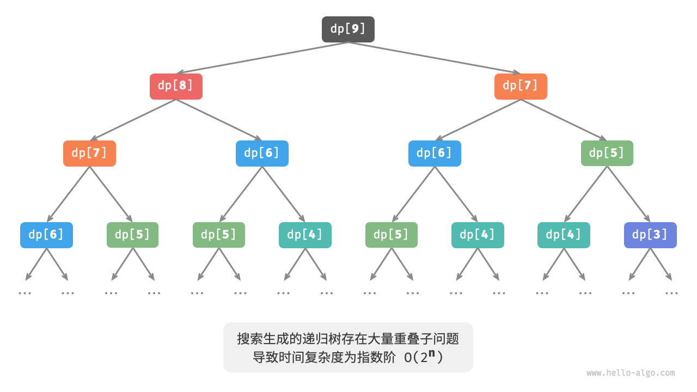

# 动态规划
## 定义和概念
将问题分解为一系列更小的子问题，并且通过储存子问题的解来避免重复计算，从而提高时间效率  


与回溯、分治的区别：  


* 分治递归的把原问题划分成多个**独立**的子问题直到最小问题，之后回溯中合并子问题的解得到原问题解
* 动态规划也递归分解，但是动态规划的子问题是相互依赖的，会出现重叠子问题
* 回溯算法在尝试和回退中穷举所有可能的解，并通过剪枝避免不必要的搜索分支。原问题的解由一系列决策步骤构成，我们可以将每个决策步骤之前的子序列看作一个子问题。

## 特性
1. 最优子结构   
原问题的最优解是从子问题的最优解构建得来的
2. 无后性  
   给定一个确定的状态，它的未来发展只与当前状态有关，而与过去经历的所有状态无关

## 问题判断
**总的来说，如果一个问题包含重叠子问题、最优子结构，并满足无后效性，那么它通常适合用动态规划求解。**   
但实际上，很难直接判断，因此
1. 先观察问题是否适合使用回溯（穷举）解决（通常满足决策树模型，其中每一个节点代表一个决策，每一条路径代表一个决策序列。）
2. 之后看加分项和减分项  
   * 加分项：  
     * 问题包含最大（小）或最多（少）等最优化描述。
     * 问题的状态能够使用一个列表、多维矩阵或树来表示，并且一个状态与其周围的状态存在递推关系。
   * 减分项：
     * 问题的目标是找出所有可能的解决方案，而不是找出最优解。
     * 问题描述中有明显的排列组合的特征，需要返回具体的多个方案。

## 常规思路
1. 描述决策
2. 定义状态
3. 建立dp表
4. 推导状态转移方程
5. 确定边界条件

状态：状态由所有决策变量构成。它应当包含描述解题进度的所有变量，其包含了足够的信息，能够用来推导出下一个状态。  

dp表： 每个状态都对应一个子问题，我们会定义一个 dp表来存储所有子问题的解，状态的每个独立变量都是 dp表的一个维度。

边界条件：边界条件在动态规划中用于初始化dp表，在搜索中用于剪枝。  

状态转移顺序的核心是要保证在计算当前问题的解时，所有它依赖的更小子问题的解都已经被正确地计算出来。


## 引入例题
给定一个共有 n阶的楼梯，你每步可以上 1阶或者 2阶，请问有多少种方案可以爬到楼顶？
1. 回溯穷举暴力：每轮除法上1阶或2阶，到达楼顶就方案数量加一，越过楼梯顶就剪枝
    ```java
    /* 回溯 */
    void backtrack(List<Integer> choices, int state, int n, List<Integer> res) {
        // 当爬到第 n 阶时，方案数量加 1
        if (state == n)
            res.set(0, res.get(0) + 1);
        // 遍历所有选择
        for (Integer choice : choices) {
            // 剪枝：不允许越过第 n 阶
            if (state + choice > n)
                continue;
            // 尝试：做出选择，更新状态
            backtrack(choices, state + choice, n, res);
            // 回退
        }
    }
    
    /* 爬楼梯：回溯 */
    int climbingStairsBacktrack(int n) {
        List<Integer> choices = Arrays.asList(1, 2); // 可选择向上爬 1 阶或 2 阶
        int state = 0; // 从第 0 阶开始爬
        List<Integer> res = new ArrayList<>();
        res.add(0); // 使用 res[0] 记录方案数量
        backtrack(choices, state, n, res);
        return res.get(0);
    }
    ```
2. 暴力搜索  

    得到一个结论dp[i] = dp[i-1] + dp[i-2]  
    可以直接递归，和回溯都一样属于深度优先搜索  
    ```java
    /* 搜索 */
    int dfs(int i) {
        // 已知 dp[1] 和 dp[2] ，返回之
        if (i == 1 || i == 2)
            return i;
        // dp[i] = dp[i-1] + dp[i-2]
        int count = dfs(i - 1) + dfs(i - 2);
        return count;
    }
    
    /* 爬楼梯：搜索 */
    int climbingStairsDFS(int n) {
        return dfs(n);
    }
    ```
    
    如图，递归树深度为n,时间复杂度为O(2^n)  
    
    主要原因是有很多子问题重叠了，被重复计算了。  

3. 记忆化搜索
   我们期望所有重叠子问题只计算一次  
   声明一个mem来记录每个子问题的解，搜索时重复子问题剪枝直接返回
   1. 当首次计算dp[i]时，我们将其记录至 mem[i] ，以便之后使用。
   2. 再次计算dp[i] 时，直接从mem[i]获取结果
    ```java
    /* 记忆化搜索 */
    int dfs(int i, int[] mem) {
        // 已知 dp[1] 和 dp[2] ，返回之
        if (i == 1 || i == 2)
            return i;
        // 若存在记录 dp[i] ，则直接返回之
        if (mem[i] != -1)
            return mem[i];
        // dp[i] = dp[i-1] + dp[i-2]
        int count = dfs(i - 1, mem) + dfs(i - 2, mem);
        // 记录 dp[i]
        mem[i] = count;
        return count;
    }
    
    /* 爬楼梯：记忆化搜索 */
    int climbingStairsDFSMem(int n) {
        // mem[i] 记录爬到第 i 阶的方案总数，-1 代表无记录
        int[] mem = new int[n + 1];
        Arrays.fill(mem, -1);
        return dfs(n, mem);
    }
    ```

    
   所有重叠子问题都只需计算一次，时间复杂度优化至 O(n)
4. 