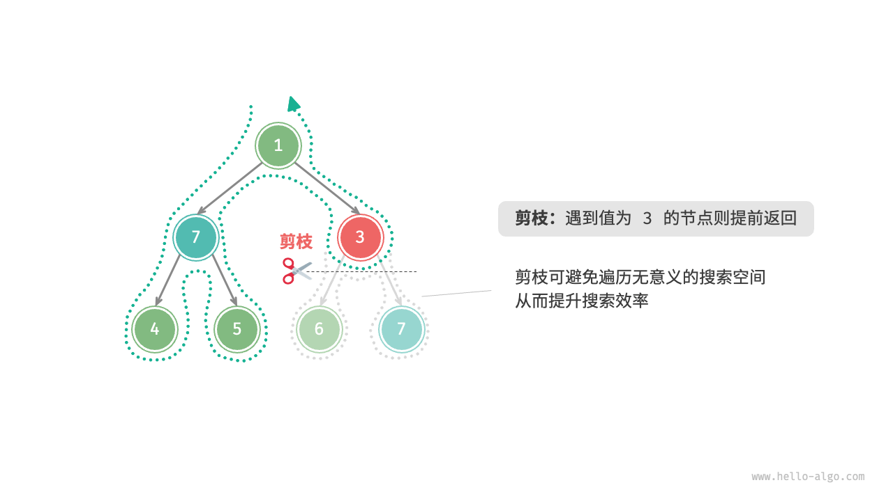
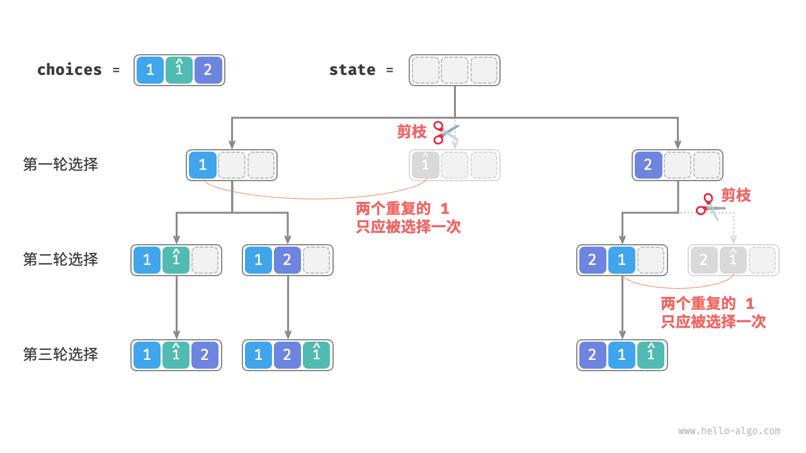
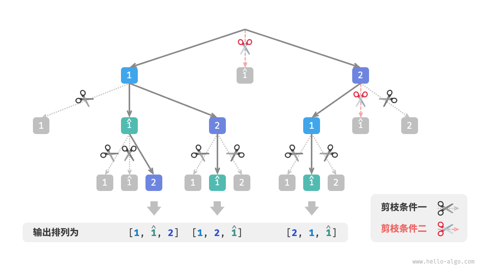
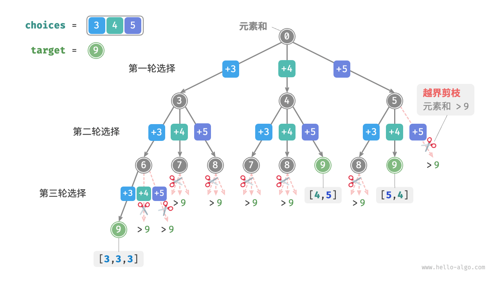

# 概念
## 定义
通过穷举来解决问题的方法，核心思想是从一个初始状态除法，暴力搜索所有可能的解决方案，遇到正确的解记录，直到找到解或者尝试所有可能无法找到解  
经常使用深度优先搜索  
## 尝试与回退
经常使用这两个策略，遇到某个状态无法前进就撤销上一步选择  
例如，`给定一棵二叉树，搜索并记录所有值为7的节点，请返回节点列表。`
```java
/* 前序遍历：例题一 */
void preOrder(TreeNode root) {
    if (root == null) {
        return;
    }
    if (root.val == 7) {
        // 记录解
        res.add(root);
    }
    preOrder(root.left);
    preOrder(root.right);
}
```
访问每个节点都表示尝试，越过叶节点return表示回退  
但回退不仅仅包括函数返回
例，`在二叉树中搜索所有值为7 的节点，请返回根节点到这些节点的路径。`
```java
/* 前序遍历：例题二 */
void preOrder(TreeNode root) {
    if (root == null) {
        return;
    }
    // 尝试
    path.add(root); //path 需要在外部定义
    if (root.val == 7) {
        // 记录解
        res.add(new ArrayList<>(path));
    }
    preOrder(root.left);
    preOrder(root.right);
    //回退，到最后遍历了root以及他的所有子节点也没找到，需要把root从path去掉
    path.remove(path.size() - 1);

    path.remove(path.size() - 1);
}
```
这里我们信仰之越的契约是：相信preOrder能处理更小规模的子树，遍历子树的root以及所有节点，并把路径添加到res，让后穷举完所有结果后回退，把path回退到之前
## 剪枝
如果有约束条件可以尝试剪枝  
例，`在二叉树中搜索所有值为7 的节点，请返回根节点到这些节点的路径，并要求路径中不包含值为3 的节点。`  
我们需要添加剪枝操作，遇到值为3的节点则提前返回不再继续找

```java
import javax.swing.tree.TreeNode;
import java.util.ArrayList;

void preOrder(TreeNode root) {
    //剪枝
    if (root == null || root.val == 3) {
        return;
    }
    //尝试
    path.add(root);
    if (root.val == 7) {
        //记录解
        res.add(new ArrayList<>(path));
    }
    //继续尝试左右边
    preOrder(root.left);
    preOrder(root.right);
    //回退
    path.remove(path.size() - 1);
}
```


## 框架代码
尝试->回退->剪枝  
state表示当前问题状态，choices表示当前状态下可做的选择

```java
import javax.swing.plaf.nimbus.State;
import java.awt.*;
import java.util.List;

void backtrack(State state, List<Choices> choices, List<State> res) {
    if (isSolution(state)) {
        recordSolution(state, res);
        //如果找到一个解就可以结束则返回
        return;
    }
    //遍历所有选择
    for (Choice choice : choices)
    {
        //判断是否需要剪枝
        if(isValid(state,choice))
        {
            //尝试：做出选择，更新状态
            makeChoice(state,choice);
            //继续深入尝试
            backtrack(state,choices,res);
            //回退：撤销选择
            undoChoice(state,choice);
        }
    }
}
```
借助框架代码解决例题

```java
import javax.swing.tree.TreeNode;
import java.util.ArrayList;
import java.util.Arrays;
import java.util.List;

boolean isSolution(List<TreeNode> state) {
    return !state.isEmpty() && state.get(state.size() - 1).val == 7;
}

void recordSolution(List<TreeNode> state, List<List<TreeNode>> res) {
    res.add(new ArrayList<>(state));
}

boolean isValid(List<TreeNode> state, TreeNode choice) {
    return choice != null && choice.val != 3;
}

void makeChoice(List<TreeNode> state, TreeNode choice) {
    state.add(choice);
}

void undoChoice(List<TreeNode> state, TreeNode choice) {
    state.remove(state.size() - 1);
}

void backtrack(List<TreeNode> state, List<TreeNode> choices, List<List<TreeNode>> res) {
    if (isSolution(state)) {
        recordSolution(state, res);
    }
    for (TreeNode choice : choices) {
        if (isValid(state, choice)) {
            makeChoice(state, choice);
            backtrack(state, Arrays.asList(choice.left,choice.right),res);
            undoChoice(state,choice);
        }
    }
}
```
## 优点与局限
本质是深度优先搜索，剪枝可以降低复杂度  
  
复杂度： 
* 时间：遍历所有可能性，复杂度可能指数阶
* 要保持当前状态（例如路径，剪枝的辅助变量）  

优化方式：  
* 剪枝
* 启发式搜索：引入策略或者估计值，优先搜索最有可能产生解的路径

# 题目
## 全排列问题
`输入一个整数数组，其中可能包含重复元素，返回所有可能的排列。`   
* **分析**  
  * 可以使用回溯，把生成排列成一系列选择的结果。  
      * choices 就是输入数组所有元素
      * state 就是已经被选择的所有元素，并且唯一（当然值可能重复，但是选取的元素唯一）
      * 剪枝  
        * 重复选择剪枝：确保每个元素只被选择一次，引入selected，selected[i]表示choices[i]是否被选择
        * 相等元素剪枝： 可以引入一个哈希集合duplicated，标记尝试过的元素  
        
        <br> 
        
        ***
        
         两种剪枝的不同


* **实现**

```java
import java.util.ArrayList;
import java.util.HashSet;
import java.util.List;

void backtrack(List<Integer> state, int[] choices, boolean[] selected, List<List<Integer>> res) {
    // 当状态长度等于元素数量时记录,就是框架代码的issolution
    if (state.size() == choices.length) {
        res.add(new ArrayList<>(state));
        //需要 返回，不可能继续下去探索了
        return;
    }
    //遍历所有选择
    Set<Integer> duplicated = new HashSet<Integer>();
    for(int i = 0; i < choices.length;i++) {
        int choice = choices[i];
        //剪枝：不允许重复选择元素 且 不允许选择相等元素
        //就是isValid
        if (!selected[i] && !duplicated.contains(choice))
        {
            //尝试做出选择，相当于makeChoice
            duplicated.add(choice); // 记录已经选择过的元素的值
            selected[i] = true; //记录被选择过的元素本身（记录索引i就行其实）
            state.add(choice);
            //进行下一轮选择
            backtrack(state,choices,selected,res);
            //回退，相当于undoChoice
            selected[i] = false;
            state.remove(state.size() - 1);
        }
    }
}

List<List<Integer>> permutations(int[] nums){
    List<List<Integer>> res = new ArrayList<>();
    backtrack(new ArrayList<>(),nums,new boolean[nums.length],res);
    return res;
}
```
* 复杂度：详见[全排列问题复杂度分析.md](%E5%85%A8%E6%8E%92%E5%88%97%E9%97%AE%E9%A2%98%E5%A4%8D%E6%9D%82%E5%BA%A6%E5%88%86%E6%9E%90.md)
  * 时间复杂度：O(n * n!)
  * 空间复杂度: O(n^2)


## 子集和问题
给定一个正整数数组 nums 和一个目标正整数 target ，请找出所有可能的组合，使得组合中的元素和等于 target 。给定数组无重复元素，每个元素可以被选取多次。请以列表形式返回这些组合，列表中不应包含重复组合。

***

**分析**
1. 可以直接参考全排列问题。但集合元素可以无限次选取，因此不必借助selected
    ```java
    /* 回溯算法：子集和 I */
    void backtrack(List<Integer> state, int target, int total, int[] choices, List<List<Integer>> res) {
        // 子集和等于 target 时，记录解
        if (total == target) {
            res.add(new ArrayList<>(state));
            return;
        }
        // 遍历所有选择
        for (int i = 0; i < choices.length; i++) {
            // 剪枝：若子集和超过 target ，则跳过该选择
            if (total + choices[i] > target) {
                continue;
            }
            // 尝试：做出选择，更新元素和 total
            state.add(choices[i]);
            // 进行下一轮选择
            backtrack(state, target, total + choices[i], choices, res);
            // 回退：撤销选择，恢复到之前的状态
            state.remove(state.size() - 1);
        }
    }
    
    /* 求解子集和 I（包含重复子集） */
    List<List<Integer>> subsetSumINaive(int[] nums, int target) {
        List<Integer> state = new ArrayList<>(); // 状态（子集）
        int total = 0; // 子集和
        List<List<Integer>> res = new ArrayList<>(); // 结果列表（子集列表）
        backtrack(state, target, total, nums, res);
        return res;
    }
    ```
    但这样比如输入[3,4,5]和目标9，会输出[3,3,3] [4,5] [5,4],因为搜索过程的全排列是区分顺序的，但实际上的子集合是不区分顺序的，如图

2. 于是考虑剪枝  
   1. 当第一轮选择[3,4]时会生成如[3,4……]这样的所有子集，
   2. 之后第一轮选择4，第二轮如果选择3,就产生[4,3……],显然重复了，应当剪去
    
    因为每一次都是从左向右尝试，因此越靠右侧剪掉的越多  
   **总之，只要让每次选择的元素索引$i_n,满足i_1<=i_2<=……<=i_n$,即可保证不重复，不满足的应当剪枝**
3. 
