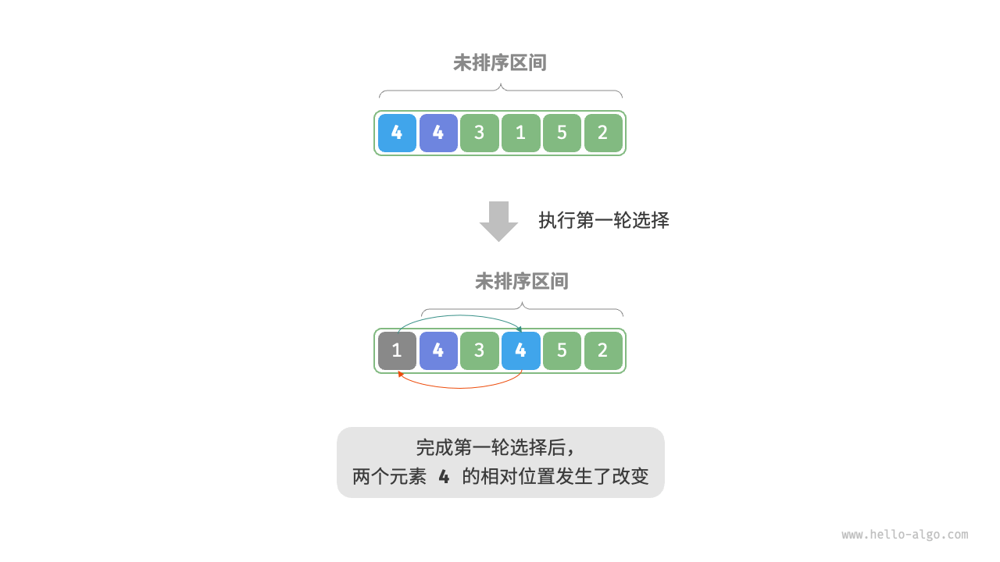

# 评价维度
* 运行效率（时间复杂度，还有常数项也尽可能小）
* 就地性（原地排序再原数组直接操作不必借助辅助数组，节省内存）
* 稳定性（排序前后相等元素相对位置不变）
* 自适应性（利用输入数据的信息减少计算量，达到更优）
* 是否基于比较（基于比较的依赖于">,<,=",理论最优时间复杂度是(O(nlogn)；非比较排序不用比较运算符，速度快但通用性差)
<br>
**目前没有发现上面所有都好的算法**
# 选择排序
```java
/* 选择排序 */
void selectionSort(int[] nums) {
    int n = nums.length;
    // 外循环：未排序区间为 [i, n-1]
    for (int i = 0; i < n - 1; i++) {
        // 内循环：找到未排序区间内的最小元素
        int k = i;
        for (int j = i + 1; j < n; j++) {
            if (nums[j] < nums[k])
                k = j; // 记录最小元素的索引
        }
        // 将该最小元素与未排序区间的首个元素交换
        int temp = nums[i];
        nums[i] = nums[k];
        nums[k] = temp;
    }
}
```
特点：
* 时间复杂度O(n方)，非自适应。(n-1)到2求和
* 空间复杂度O(1),原地排序。
* 非稳定性排序

# 冒泡
```java
/* 冒泡排序（标志优化） */
void bubbleSortWithFlag(int[] nums) {
    // 外循环：未排序区间为 [0, i]
    for (int i = nums.length - 1; i > 0; i--) {
        boolean flag = false; // 初始化标志位
        // 内循环：将未排序区间 [0, i] 中的最大元素交换至该区间的最右端
        for (int j = 0; j < i; j++) {
            if (nums[j] > nums[j + 1]) {
                // 交换 nums[j] 与 nums[j + 1]
                int tmp = nums[j];
                nums[j] = nums[j + 1];
                nums[j + 1] = tmp;
                flag = true; // 记录交换元素
            }
        }
        if (!flag)
            break; // 此轮“冒泡”未交换任何元素，直接跳出
    }
}
```
* 时间复杂度O(n*n),优化后是自适应排序。(n-1)到1求和
* 空间复杂度O(1)，原地排序
* 稳定性排序

# 插入排序
类似整理扑克牌，从未排序区间选一个基准元素，把ta和左侧已排序区间逐一比较并插入到正确地方

```java
/* 插入排序 从小到大*/
void insertionSort(int[] nums) {
    //外循环，已经排序的区间是[0,i-1]
    for (int i = 1;i< nums.length;i++)
    {
        int base = nums[i],j = i - 1;
        //把base插入已排序区间的合适位置
        while(j >= 0 && nums[j] > base)
        {
            /*
           把比base大的元素都向右移动，
           因为我们已经存取了索引为i的元素为base，所以不必担心覆盖
             */
            nums[j+1] = nums[j];
            j--;
        }
        //循环结束时，j索引一定是第一个不大于base的元素
        //原本的j+1索引的元素是第一个大于base的元素，已经向右移动了
        //因此直接插入在j+1即可
        nums[j + 1] = base;
    }
}
```
* 时间复杂度O(n*n),自适应性。1加到(n-1)。遇到有序数组时，内循环（插入操作）会提前终止，达到最佳复杂度O(n).
* 空间复杂度O(1),原地排序。
* 稳定排序。插入时我们插入在相等元素右侧。

**虽然复杂度是O(n*n),但数据量小时可能比快排更快**<br><br>
#### 实践中插入排序使用频率高于冒泡和选择
* 冒泡： 基于元素交换，涉及3个单元操作，插入排序基于元素赋值，只需要一个单元操作
* 选择： 不自适应，任何时候都是O(n*n),

# 快速排序
基于分治策略<br>
核心是**哨兵划分**：目标是选择数组某个元素作为基准数，将所有小于基准数的元素移到左侧，大于的移到右侧。
<br>
```java
void swap(int[] nums,int i,int j){
    int temp = nums[i];
    nums[i] = nums[j];
    nums[j] = temp;
}
/*哨兵划分*/
int partition(int[] nums,int left,int right){
    //我们以nums[left]为基准
    int i = left , j = right;
    while (i < j){
        while(i < j && nums[j] >= nums[left]){
            j--;//从右向左找首个小于基准数的
        }
        while (i<j && nums[i] <= nums[left]){
            i++;//从左向右找到首个大于基准数的
        }
        swap(nums,i,j);
    }
    // 最终i，j一定相等，作为分界线
    swap(nums,i,left);
    return i; 
}
```
最终达到左边子数组任意元素<=基准数<=右边子数组
```java
void quickSort(int[] nums,int left,int right){
    //基本情况，如果数组长度为1天然有序
    if(left >= right){
        return;
    }
    //基于分治策略，把一个长数组划分成两个短数组。
    //有两个作用：1.把pivot放在正确的顺序索引上
    //         2.左边子数组任意元素<=基准数<=右边子数组

    int pivot = partition(nums,left,right);
    //分别排序pivot左右两侧的数组
    quickSort(nums,left,pivot-1);
    quickSort(nums,pivot+1,right);
    //最终左右两侧，pivot自己都有序
}
```
* 平均时间复杂度O(nlongn)，非自适应：平均情况下递归层数为logn,每层中操作数为O(n)(主要是哨兵划分，各个子数组操作之和)。
<br>但最差时(哨兵选取的是最大或者最小的元素时），每轮哨兵划分都分为长度为0和n-1的子数组，递归层数会达到n，复杂度达到O(n*n).
* 空间复杂度O(n),原地排序：递归深度最差达到n(哨兵选取的是最大或者最小元素时)。直接操作员数组，没有借助额外空间
* 非稳定性：partition的最后一步，把基准元素调换到分界线时可能改变和基准元素相等的元素的相对位置

## 优化
### 基准数选取优化
下面是一种方法，选取首、尾、中点的中位数。
```java
/* 选取三个候选元素的中位数 */
int medianThree(int[] nums, int left, int mid, int right) {
    int l = nums[left], m = nums[mid], r = nums[right];
    if ((l <= m && m <= r) || (r <= m && m <= l))
        return mid; // m 在 l 和 r 之间
    if ((m <= l && l <= r) || (r <= l && l <= m))
        return left; // l 在 m 和 r 之间
    return right;
}
/* 哨兵划分（三数取中值） */
int partition(int[] nums, int left, int right) {
    // 选取三个候选元素的中位数
    int med = medianThree(nums, left, (left + right) / 2, right);
    // 将中位数交换至数组最左端，之后就可以直接复用上面的代码了
    swap(nums, left, med);
    // 以 nums[left] 为基准数
    int i = left, j = right;
    while (i < j) {
        while (i < j && nums[j] >= nums[left])
            j--;          // 从右向左找首个小于基准数的元素
        while (i < j && nums[i] <= nums[left])
            i++;          // 从左向右找首个大于基准数的元素
        swap(nums, i, j); // 交换这两个元素
    }
    swap(nums, i, left);  // 将基准数交换至两子数组的分界线
    return i;             // 返回基准数的索引
}

```

### 递归深度优化
最差空间复杂度优化为O(logn):即便在基准数选取最大或者最小值时也保证O(logn)
<br>
我们可以只对划分出来的短子数组进行递归，长子数组利用迭代在下次循环处理。
```java
void quickSort(int [] nums , int left ,int right){
    while(left<right){//基本情况隐含了，子数组长度小于等于直接返回
        int pivot = parition(nums,left,right);
        if(pivot - left < right - pivot){
            quickSort(nums,left,pivot-1);
            left = pivot + 1;//左子数组被排序过了，这是新的未排序的左边界
        }
        else{
            quickSort(nums,pivot + 1,right);
            right = pivot - 1;//右子数组被排序过了，这是新的未排序的右边界
        }
    }
}
```
由于每次较短的子数组必定小于等于n/2,因此这种方法递归深度必然不超过O(logn)
<br>
最差空间复杂度优化为O(logn)

# 归并排序
也基于分治策略，
<br>
1. 划分阶段：用递归将数组从中点处分开
2. 合并阶段：数组长度为1时停止开始合并

<br>
归并排序的顺序和二叉树的后序遍历类似。
* 后序遍历：先递归左子树，再递归右子树，最后处理根节点
* 归并排序：先递归左子树组，再递归右子树组，最后处理合并
```java
void merge (int[] nums,int left,int mid,int right)
{
    //左子数组区间时[left,mid],右子树组是[mid+1,right]
    //temp存放合并后的结果
    int [] temp = new int[right - left +1];
    int i = left,j = mid+1,k = 0;
    //当左右数组都有元素时，进行比较并把较小的元素复制到数组中
    while (i <= mid && j <= right)
    {
        if(nums[i] <= nums[j])
        {
            temp[k++] = nums[i++];
        }
        else {
            temp[k++] = nums[j++];
        }
    }
    //当任意一个数组元素被遍历完后，把剩余元素复制到临时数组
    while (i<=mid)
    {
        temp[k++] = nums[i++];
    }
    while (j <= right)
    {
        temp[k++] = nums[j++];
    }
    //将temp复制回原数组对应区间
    for(k = 0;k< temp.length;k++)
    {
        nums[left + k] = temp[k];
    }
}

/*归并排序*/
void mergeSort(int[] nums,int left,int right)
{
    //基本情况
    if(left >= right)
    {
        return;
    }
    int mid = left + (right - left)/2;
    //相信mergeSort能处理更小规模的
    //先对左侧归并排序
    mergeSort(nums,left,mid);
    //堆右侧归并排序
    mergeSort(nums,mid+1,right);
    //最后把左右子数组进行合并
    merge(nums,left,mid,right);
}
```
* 时间复杂度O(nlogn)、非自适应。递归高度logn,每层一共的合并操作都是n
* 空间复杂度O(n)、非原地排序。递归调用栈O(logn),合并操作的辅助数组O(n).
* 稳定排序（我们先处理了左侧的子数组）
