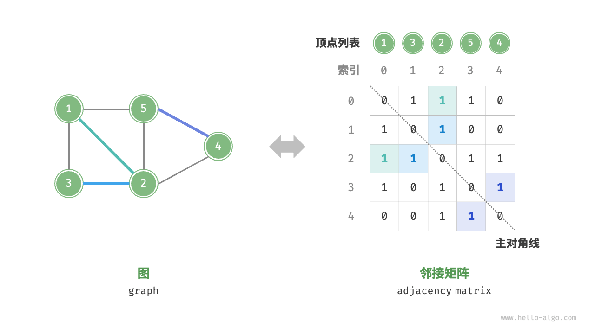

# 图的实现
## 邻接矩阵

```java
import java.util.ArrayList;
import java.util.List;

class GraphAdjMat {
    List<Integer> vertices;//顶点列表，元素代表顶点值，索引是顶点索引
    List<List<Integer>> adjMat; //邻接矩阵，行列索引对应顶点索引

    public GraphAdjMat(int[] vertices, int[][] edges) {
        this.vertices = new ArrayList<>();
        this.adjMat = new ArrayList<>();
        //添加顶点
        for(int val : vertices)
        {
            addVertex(val);
        }
        /*
                添加边
                注意
                edges这个二维数组里面表示的是索引对应的顶点直接有边
                如int[][] edges = {{0, 1}, {0, 2}, {1, 3}};
                第一个元素{0,1}表示索引0，1对应的顶点之间有边
         */
        for(int[] e : edges)
        {
            addEdge(e[0],e[1]);
        }
    }
    public int size(){
        return vertices.size();
    }
    public void addVertex(int val){
        int n = size();
        vertices.add(val);
        List<Integer> newRow = new ArrayList<>();
        for(int j = 0;j < n ;j++)
        {
            newRow.add(0);
        }
        adjMat.add(newRow);
        for(List<Integer> row : adjMat){
            row.add(0);
        }
    }
    public void removeVertex(int index){
        if (index >= size())
        {
            throw new IndexOutOfBoundsException();
        }
        vertices.remove((index));
        adjMat.remove(index);
        for (List<Integer> row : adjMat)
        {
            row.remove(index);
        }
    }
    
    public void addEdge(int i , int j)
    {
        if(i <0 || j< 0 || i>= size() || j>= size() || i==j)
        {
            throw new IndexOutOfBoundsException();
        }
        adjMat.get(i).set(j,1);
        adjMat.get(j).set(i,1);
    }
    public void removeEdge(int i ,int j){
        if(i<0||j<0||i>=size()||j>=size()){
            throw new IndexOutOfBoundsException();
        }
        adjMat.get(i).set(j,0);
        adjMat.get(j).set(i,0);
    }
    public void print(){
        System.out.print("顶点列表 = ");
        System.out.println(vertices);
        System.out.println("邻接矩阵 = ");

        for (List<Integer> row : adjMat) {
            for (int val : row) {
                System.out.print(val + " ");
            }
            System.out.println(); 
        }

    }
}
```
## 邻接表
实际上我们使用Vertex类表示顶点，借助哈希表来实现每个邻接表的“链表”

```java
class Vertex {
    int val;

    Vertex(int val) {
        this.val = val;
    }

    // 必须重写 equals 方法
    @Override
    public boolean equals(Object obj) {
        if (this == obj) return true;
        if (obj == null || getClass() != obj.getClass()) return false;
        Vertex vertex = (Vertex) obj;
        return val == vertex.val;
    }

    // 必须重写 hashCode 方法
    @Override
    public int hashCode() {
        return Integer.hashCode(val);
    }
}
```
我们想用Vertex作为key，哈希表必须知道怎么去实现哈希算法从而快速找到把这个key放在哪里，也需要知道怎么去比较两个key是否相等。
<br>
**因此务必重写hashCode(哈希算法)和equals方法。**
```java
import java.util.ArrayList;
import java.util.HashMap;
import java.util.List;
import java.util.Map;

class GraphAdjList {
    Map<Vertex, List<Vertex>> adjList;

    public GraphAdjList(Vertex[][] edges) {
        this.adjList = new HashMap<>();
        for (Vertex[] edge : edges) {
            addVertex(edge[0]);
            addVertex(edge[1]);
            addEdge(edge[0], edge[1]);
        }
    }

    public int size() {
        return adjList.size();
    }

    public void addEdge(Vertex vet1, Vertex vet2) {
        if (!adjList.containsKey(vet1) || !adjList.containsKey(vet2)) {
            throw new IllegalArgumentException();
        }
        adjList.get(vet1).add(vet2);
        adjList.get(vet2).add(vet1);
    }

    public void removeEdge(Vertex vet1, Vertex vet2) {
        if (!adjList.containsKey(vet1) || !adjList.containsKey(vet2) || vet1 == vet2) {
            throw new IllegalArgumentException();
        }
        adjList.get(vet1).remove(vet2);
        adjList.get(vet2).remove(vet1);
    }

    public void addVertex(Vertex vet) {
        if (adjList.containsKey(vet)) {
            return;
        }
        adjList.put(vet, new ArrayList<>());
    }

    public void removeVertex(Vertex vet) {
        if (!adjList.containsKey(vet)) {
            throw new IllegalArgumentException();
        }
        adjList.remove(vet);
        for (List<Vertex> list : adjList.values()) {
            list.remove((vet));
        }
    }

    public void print() {
        System.out.println("邻接表 = ");
        for (Map.Entry<Vertex,List<Vertex>> pair : adjList.entrySet())
        {
            List<Integer> temp = new ArrayList<>();
            for (Vertex vertex : pair.getValue())
            {
                temp.add(vertex.val);
            }
            System.out.println(pair.getKey().val + ": " + temp + ",");
        }
    }
}
```
| |     邻接矩阵     |邻接表（链表）|邻接表（哈希表）|
|:---|:------------:|:---:|:---:|
|**判断是否邻接**|     O(1)     |O(n)|O(1)|
|**添加边**|     O(1)     |O(1)|O(1)|
|**删除边**|     O(1)     |O(n)|O(1)|
|**添加顶点**|     O(n)     |O(1)|O(1)|
|**删除顶点**|    O(n*n)    |O(n+m)|O(n+m)|
|**内存空间**|    O(n*n)    |O(n+m)|O(n+m)|

请注意，邻接表（链表）对应本文实现，而邻接表（哈希表）专指将所有链表替换为哈希表后的实现。


# 图的遍历
## 广度遍历（BFS）
使用队列
<br>
遍历起始顶点加入队列，每次迭代弹出队首并记录访问，之后把顶点所有的邻接节点加入队尾

```java
import java.util.ArrayList;
import java.util.HashSet;
import java.util.LinkedList;
import java.util.Queue;

List<Vertex> graphBFS(GraphAdjList graph, Vertex startVet) {
    List<Vertex> res = new ArrayList<>();
    Set<Vertex> visited = new HashSet<>();
    visited.add(startVet);
    Queue<Vertex> que = new LinkedList<>();
    que.offer(startVet);
    while (!que.isEmpty())
    {
        Vertex vet = que.poll();
        res.add(vet);
        //相当于遍历边
        for(Vertex adjVet : graph.adjList.get(vet))//adjList邻接矩阵
        {
            if(visited.contains(adjVet))
            {
                continue;
            }
            que.offer(adjVet);
            visited.add(adjVet);
        }
    }
    return res;
}
```
时间复杂度：O(V+E)
<br>
空间复杂度：O（V）
## 深度优先（DFS）

```java
import java.util.ArrayList;
import java.util.HashSet;
import java.util.List;


void dfs(GraphAdjList graph, Set<Vertex> visited, List<Vertex> res, Vertex vet) {
    if (visited.contains(vet)) {
        return;
    }
    res.add(vet);
    visited.add(vet);
    //依然是，访问邻接节点相当于再访问边。
    for (Vertex adjVet : graph.adjList.get(vet)) {
        dfs(graph, visited, res, adjVet);
    }
}

List<Vertex> graphDFS(GraphAdjList graph, Vertex startVet) {
    List<Vertex> res = new ArrayList<>();
    Set<Vertex> visited = new HashSet<>();
    dfs(graph,visited,res,startVet);
    return res;
}
```
可以优化成调用前检查
```java
void dfs(GraphAdjList graph, Set<Vertex> visited, List<Vertex> res, Vertex vet) {
    res.add(vet);     // 记录访问顶点
    visited.add(vet); // 标记该顶点已被访问
    // 遍历该顶点的所有邻接顶点
    for (Vertex adjVet : graph.adjList.get(vet)) {
        //基本情况隐藏在这里，如果所有邻接节点都被访问，就会返回
        if (visited.contains(adjVet))
            continue; // 跳过已被访问的顶点
        // 递归访问邻接顶点
        dfs(graph, visited, res, adjVet);
    }
}

```
显式写出基本情况时，如果某个邻接节点被访问过，依然会递归调用一次dfs，性能会略微低点。
<br>
时间复杂度：O(V+E)，所有顶点都会被访问一次，用O（V）时间，所有边被访问两次，O（E）
空间复杂度：res，visited都是O（V），递归深度最多也是O（V），总体就是O（V）。

